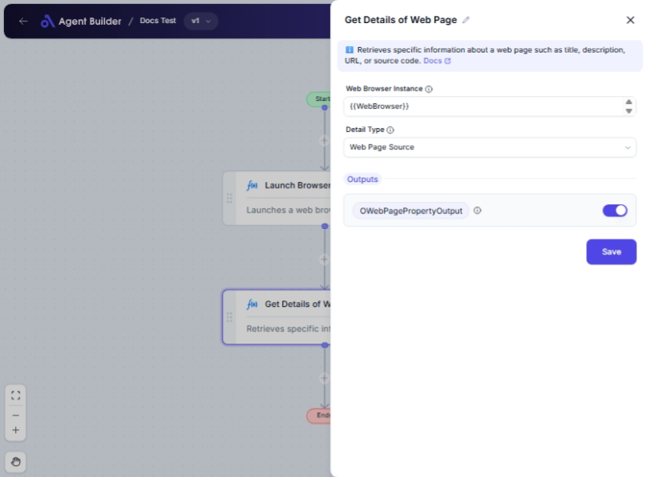

import { Callout, Steps } from "nextra/components";

# Get Details of Web Page

The **Get Details of Web Page** node allows you to retrieve specific information from a web page through a provided web browser instance. This is useful for extracting website metadata, such as titles, descriptions, keywords, HTML source, or URLs, which can be utilized in tasks like SEO analysis, content extraction, or automated reporting.

  

## Configuration Options

| Field Name               | Description                                                                                   | Input Type | Required? | Default Value  |
| ------------------------ | --------------------------------------------------------------------------------------------- | ---------- | --------- | -------------- |
| **Web Browser Instance** | Enter or choose the variable that contains the web browser instance to work with.             | Text       | Yes       | _(empty)_      |
| **Detail Type**          | Choose which web page detail you'd like to retrieve, such as title, description, or keywords. | Select     | Yes       | Web Page Title |

## Expected Output Format

The output from this node, labeled as **Web Page Property**, varies depending on the selected **Detail Type**:

- **Web Page Title**: Output as a text string.
- **Web Page Description**: Output as a text string.
- **Web Page Meta Keywords**: Output as a text string, potentially a comma-separated list.
- **Web Page Text**: Output as a text string containing visible text.
- **Web Page Source**: Output as a full-length text string (HTML code).
- **Current URL Address**: Output as a text string (URL format).

## Step-by-Step Guide

<Steps>
### Step 1

Add the **Get Details of Web Page** node into your workflow.

### Step 2

In the **Web Browser Instance** field, enter the name of the variable that holds your web browser instance.

### Step 3

In the **Detail Type** dropdown, choose the specific web page detail you want to obtain:

- **Web Page Title**: Retrieve the title of the page.
- **Web Page Description**: Get the meta description.
- **Web Page Meta Keywords**: Extract the meta keywords.
- **Web Page Text**: Obtain all visible text content.
- **Web Page Source**: Collect the full HTML source.
- **Current URL Address**: Acquire the current URL.

### Step 4

The extracted information will be available as **OWebPagePropertyOutput** for utilization in other nodes.

</Steps>

<Callout type="info" title="Tip">
  Ensure that the browser instance is correctly initialized and points to a
  valid web page before retrieving details.
</Callout>

## Common Mistakes & Troubleshooting

| Problem                          | Solution                                                                                                                       |
| -------------------------------- | ------------------------------------------------------------------------------------------------------------------------------ |
| **Invalid web browser instance** | Verify that the instance variable is correctly defined and accessible within the workflow.                                     |
| **Unexpected or null outputs**   | Ensure the web page is fully loaded and the correct detail type is selected to match the information you're aiming to extract. |

## Real-World Use Cases

- **SEO Analysis**: Retrieve metadata like titles and descriptions for SEO reviews.
- **Content Monitoring**: Capture web page text to monitor content updates.
- **Data Gathering**: Extract keywords, text, or URLs for further processing and analysis.
- **Documentation**: Acquire source HTML for documentation or archiving purposes.
