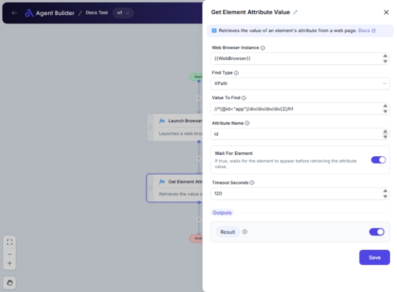

import { Callout, Steps } from "nextra/components";

# Get Element Attribute Value

The **Get Element Attribute Value** node is used to extract the value of a specific attribute from a web page element. This is particularly useful for tasks such as data scraping, website testing, or automation workflows where you need to retrieve specific data from web elements, such as links (href), image sources (src), or input values.

{/*  */}

## Configuration Options

| Field Name               | Description                                                                               | Input Type | Required? | Default Value |
| ------------------------ | ----------------------------------------------------------------------------------------- | ---------- | --------- | ------------- |
| **Web Browser Instance** | The existing web browser instance (e.g., IWebDriver) to interact with.                    | Text       | Yes       | _(empty)_     |
| **Find Type**            | Specifies how to find the element (e.g., ID, XPath, CssSelector).                         | Select     | Yes       | XPath         |
| **Value To Find**        | The value used to locate the element (e.g., 'username', '//input[@id='email']').          | Text       | Yes       | _(empty)_     |
| **Attribute Name**       | The name of the attribute whose value should be retrieved (e.g., 'value', 'href', 'src'). | Text       | Yes       | _(empty)_     |
| **Wait For Element**     | If true, waits for the element to appear before retrieving the attribute value.           | Switch     | No        | false         |
| **Timeout Seconds**      | Maximum time in seconds to wait for the element before failing.                           | Text       | No        | 60            |

## Expected Output Format

The output of this node is a **string value** of the specified attribute from the web element.

- The retrieved attribute value will be provided as **Result** for use in subsequent nodes.

## Step-by-Step Guide

<Steps>
### Step 1

Add **Get Element Attribute Value** node into your flow.

### Step 2

In the **Web Browser Instance** field, input the instance of your web browser that is currently active and interacting with the web page.

### Step 3

In the **Find Type** dropdown, select how you wish to locate the target element. Options include XPath, ID, CssSelector, etc.

### Step 4

Enter the specific **Value To Find** that corresponds to your chosen method of locating the element. For example, use an ID string or an XPath expression.

### Step 5

Specify the **Attribute Name** whose value you want to retrieve from the element. This might be attributes like 'href', 'src', etc.

### Step 6

Optionally toggle the **Wait For Element** switch to allow for dynamic web content loading, which waits for the element's presence before attempting retrieval.

### Step 7

Set the **Timeout Seconds** field to determine how long the node should wait for the element before timing out, especially if Wait For Element is enabled.

### Step 8

The attribute's value will be output as **Result**, ready for use in subsequent processing.

</Steps>

<Callout type="info" title="Tip">
  If the attribute you're looking to retrieve may not be immediately available
  due to dynamic loading, consider enabling **Wait For Element** and adjust the
  **Timeout Seconds** accordingly.
</Callout>

## Input/Output Examples

- For a web element with ID `submit-button` and the attribute `disabled="true"`:
  - **Find Type**: Id
  - **Value To Find**: submit-button
  - **Attribute Name**: disabled
  - **Output Value**: "true"

## Common Mistakes & Troubleshooting

| Problem                                  | Solution                                                                                                                              |
| ---------------------------------------- | ------------------------------------------------------------------------------------------------------------------------------------- |
| **Element not found error**              | Double-check the **Find Type** and **Value To Find** parameters to ensure they correctly match an existing web element.               |
| **Incorrect attribute value retrieval**  | Verify that the **Attribute Name** is typed correctly and corresponds to the attribute you intend to retrieve.                        |
| **Timeout errors with Wait For Element** | Increase the **Timeout Seconds** to a value sufficient for elements that take longer to load, especially in dynamic web environments. |

## Real-World Use Cases

- **Web Scraping**: Extracting link URLs (`href`) from navigation elements on a webpage.
- **Form Testing**: Checking the state of form fields by retrieving attributes like `value` or `placeholder`.
- **Data Automation**: Gathering dynamic content data such as image sources (`src`) for reporting or analysis.
