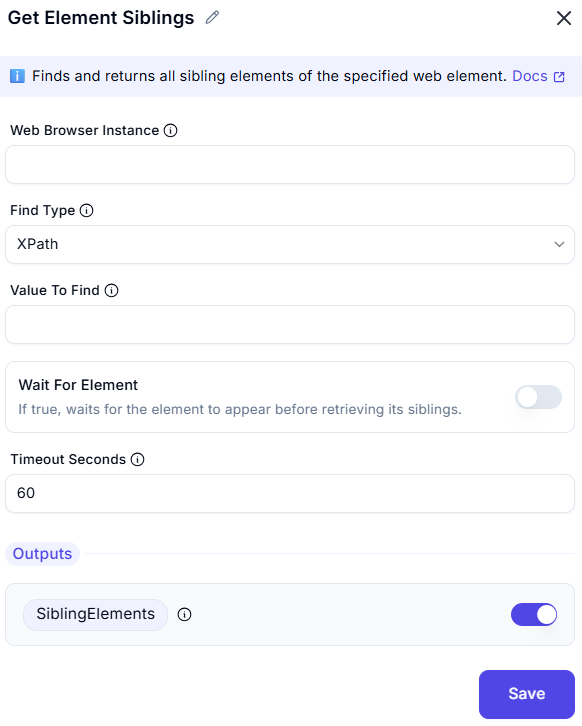

## Get Element Siblings

This module **retrieves all sibling elements** of a specified element on a web page.

 

### Fields

- **Web Browser Instance**  
  Specifies the browser session to operate on.

- **Find Type**  
  Method for locating the element.  
  Default: `XPath`  
  (Other options might include CSS Selector, ID, etc.)

- **Value To Find**  
  The value or expression (e.g., XPath) used to locate the element whose siblings will be fetched.

- **Wait For Element**  
  Optional toggle. If enabled, the action will wait until the target element appears before attempting to get its siblings.

- **Timeout Seconds**  
  Specifies how long (in seconds) to wait for the element if "Wait For Element" is enabled.  
  Default: `60`

---

### Outputs

- **SiblingElements** (toggleable)  
  Returns the list of sibling elements found for the specified target.

---

### Action Button

- **Save**  
  Saves and applies the configuration.
