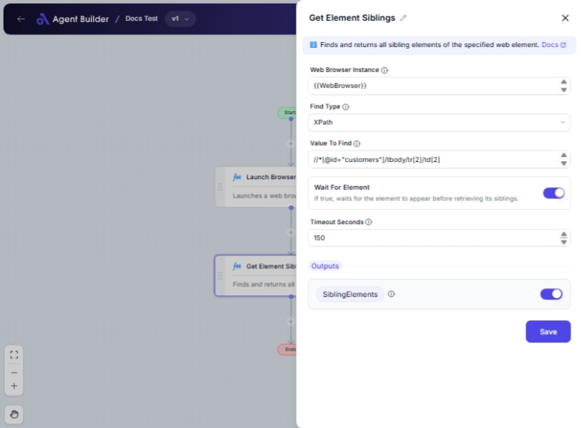

import { Callout, Steps } from "nextra/components";

# Get Element Siblings

The **Get Element Siblings** node is used to find and retrieve sibling HTML elements from a web page. This is particularly useful when you need to manipulate or analyze elements that are located at the same hierarchy level in the DOM (Document Object Model) as the specified target element.

For example, you might use this node to select all items in a list except the one you initially specified or to gather information from a group of input fields related by their proximity.

{/*  */}

## Configuration Options

| Field Name               | Description                                                                          | Input Type | Required? | Default Value |
| ------------------------ | ------------------------------------------------------------------------------------ | ---------- | --------- | ------------- |
| **Web Browser Instance** | Enter or choose the variable that contains the web browser instance to work with.    | Text       | Yes       | _(empty)_     |
| **Find Type**            | Specifies how to find the element (e.g., XPath, Id, Css Selector).                   | Select     | Yes       | XPath         |
| **Value To Find**        | The value used to locate the element (e.g., `'username'`, `'//input[@id='email']'`). | Text       | Yes       | _(empty)_     |
| **Wait For Element**     | If true, waits for the element to appear before retrieving its siblings.             | Switch     | No        | _(empty)_     |
| **Timeout Seconds**      | Maximum time in seconds to wait for the element before failing.                      | Text       | No        | 60            |

## Expected Output Format

The output of this node is a **collection of sibling elements**. Each sibling element can be accessed and manipulated within your automation flow.

## Step-by-Step Guide

<Steps>
### Step 1

Add **Get Element Siblings** node into your flow.

### Step 2

In the **Web Browser Instance** field, enter the variable that represents the web browser you are working with.

### Step 3

Select a **Find Type** from the dropdown to specify how the target element should be identified (e.g., XPath, ID).

### Step 4

Enter the **Value To Find** corresponding to the find type you selected. This is usually a unique identifier like an ID or a XPath query.

### Step 5

(Optional) Toggle **Wait For Element** if you want the operation to pause until the element appears on the page.

### Step 6

(Optional) Set the **Timeout Seconds** to control how long the operation should wait before failing if the element does not appear.

### Step 7

The sibling elements will be available as **SiblingElements** for use in other nodes.

</Steps>

<Callout type="info" title="Note">
  Selecting the correct "Find Type" and accurately setting the "Value To Find"
  is crucial for successfully locating the target element.
</Callout>

## Input/Output Examples

| Find Type | Value To Find        | Wait For Element | Timeout Seconds | Output Value    | Output Type  |
| --------- | -------------------- | ---------------- | --------------- | --------------- | ------------ |
| XPath     | //div[@class='item'] | true             | 30              | SiblingElements | Element List |
| Id        | header-section       | false            | _(default: 60)_ | SiblingElements | Element List |

## Common Mistakes & Troubleshooting

| Problem                          | Solution                                                                                  |
| -------------------------------- | ----------------------------------------------------------------------------------------- |
| **Element not found error**      | Ensure the **Web Browser Instance** and **Value To Find** correctly reflect the target.   |
| **Timeout too short**            | Increase **Timeout Seconds** to allow more time for elements to load in slow connections. |
| **Incorrect siblings retrieved** | Double-check your **Find Type** and **Value To Find** values.                             |

## Real-World Use Cases

- **Navigating Lists**: Retrieve all list items in alphabetical order when they are loaded at the same DOM level.
- **Form Analysis**: Collect all form fields sitting at the same level, useful for automated filling or validation.
- **Table Manipulation**: Extract data from rows of a table while ignoring the header row.
