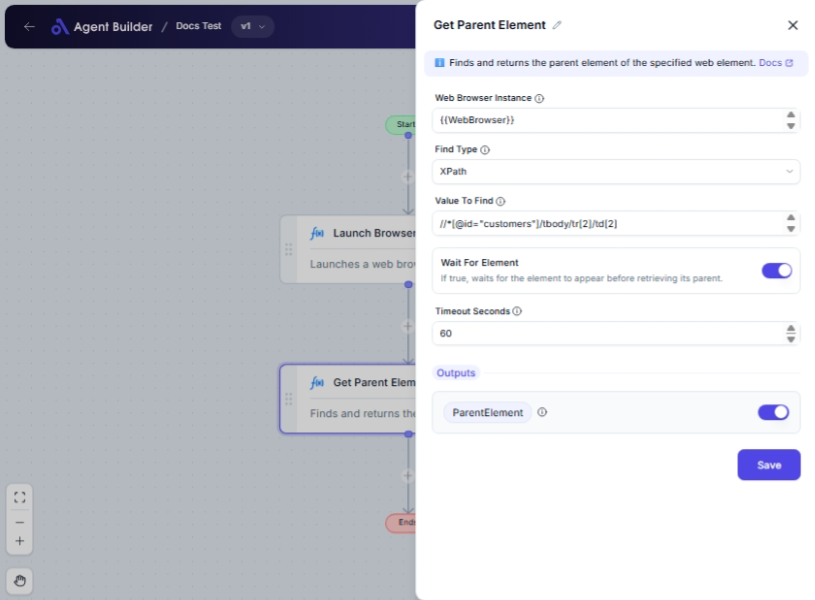

import { Callout, Steps } from "nextra/components";

# Get Parent Element

The **Get Parent Element** node is designed to help you interact with web page elements by retrieving the parent element of a specific child element. This can be particularly useful when you need to manipulate or analyze a parent element for further actions, like styling changes or additional automation tasks.

For example:

- Identifying the container element for a given input field or button.
- Navigating through a web page's hierarchical structure to locate parent nodes.

## Configuration Options

| Field Name               | Description                                                                        | Input Type | Required? | Default Value |
| ------------------------ | ---------------------------------------------------------------------------------- | ---------- | --------- | ------------- |
| **Web Browser Instance** | Enter or choose the variable that contains the web browser instance to work with.  | Text       | Yes       | _(empty)_     |
| **Find Type**            | Specifies how to find the element (e.g., ID, XPath, CssSelector).                  | Select     | Yes       | XPath         |
| **Value To Find**        | The value used to locate the element (e.g., 'username', '//input[@id=\'email\']'). | Text       | Yes       | _(empty)_     |
| **Wait For Element**     | If true, waits for the element to appear before retrieving its parent.             | Switch     | No        | _(empty)_     |
| **Timeout Seconds**      | Maximum time in seconds to wait for the element before failing.                    | Text       | No        | 60            |

## Expected Output Format

The output of this node is a **web element object**. Specifically, it returns the parent `IWebElement` of the found element, which you can use in subsequent nodes for further operations.

## Step-by-Step Guide

<Steps>
### Step 1

Add the **Get Parent Element** node into your flow.

### Step 2

In the **Web Browser Instance** field, select or enter the variable that contains the web browser instance you are working with.

### Step 3

Choose the method to locate the element in the **Find Type** dropdown. Available options include XPath, ID, CssSelector, and more.

### Step 4

In the **Value To Find** field, specify the exact value or path you will use to find the element. This could be an XPath expression, HTML ID, etc.

### Step 5

Toggle **Wait For Element** if you want the process to pause until the element appears. Adjust **Timeout Seconds** to change how long the system waits before timing out.

### Step 6

Once set up, the node will output the **ParentElement**, which you can use in other nodes.

</Steps>

<Callout type="info" title="Tip">
  Using the **Wait For Element** option is recommended if the target element may
  load asynchronously, preventing unwanted failures.
</Callout>

## Input/Output Examples

| Find Type | Value To Find          | Wait For Element | Timeout Seconds | Output Value  | Output Type        |
| --------- | ---------------------- | ---------------- | --------------- | ------------- | ------------------ |
| XPath     | `//input[@id='email']` | True             | 30              | ParentElement | Web Element Object |
| Id        | `submit-button`        | False            | _(default: 60)_ | ParentElement | Web Element Object |

## Common Mistakes & Troubleshooting

| Problem                                    | Solution                                                                                                                                                     |
| ------------------------------------------ | ------------------------------------------------------------------------------------------------------------------------------------------------------------ |
| **Element not found**                      | Ensure the **Web Browser Instance** is correct, and double-check the **Find Type** and **Value To Find** for accuracy (e.g., correct XPath/ID/CSS selector). |
| **Parent element not correctly retrieved** | Verify that the specified element has a parent node, or adjust the find criteria for accuracy.                                                               |
| **Timeout errors**                         | Increase **Timeout Seconds** or ensure the element becomes available within the set timeout when using **Wait For Element**.                                 |

## Real-World Use Cases

- **Scraping Data**: Use the parent element to extract related information blocks for complex data scraping tasks.
- **Frontend Testing**: Testing frameworks can utilize parent elements to validate UI behavior changes.
- **Web Automation**: Automate styling, content changes or element interactions by accessing and manipulating parent elements.
