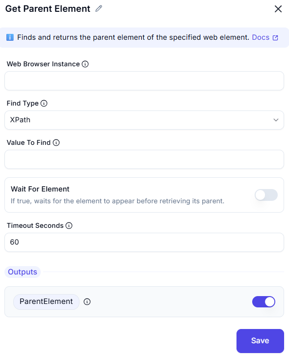

## Get Parent Element

This action **finds and returns the parent element** of a specified web element.

 

### Fields

- **Web Browser Instance**  
  Identifies the browser session to operate on.

- **Find Type**  
  The method used to locate the target element.  
  Default: `XPath`

- **Value To Find**  
  The expression (e.g., XPath) that identifies the target element whose parent will be retrieved.

- **Wait For Element**  
  Optional toggle. If enabled, the action waits for the target element to appear before attempting to get its parent.

- **Timeout Seconds**  
  How long (in seconds) to wait for the element if "Wait For Element" is turned on.  
  Default: `60`

---

### Outputs

- **ParentElement** (toggleable)  
  Returns the parent of the specified web element.

---