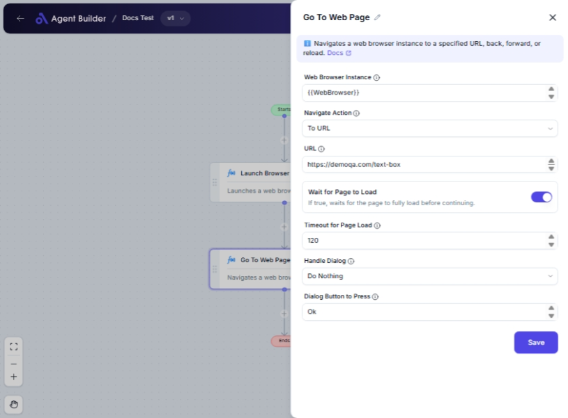

import { Callout, Steps } from "nextra/components";

# Go To Web Page

The **Go To Web Page** node is designed to control a browser instance and navigate web pages. This node provides flexibility to perform various browser actions like navigating to a specific URL, going backwards or forwards in the browser history, and refreshing the current page. It's particularly useful for automating web browsing tasks, accessing information, or handling web-based applications seamlessly.

{/*  */}

## Configuration Options

| Field Name                 | Description                                                                       | Input Type | Required? | Default Value |
| -------------------------- | --------------------------------------------------------------------------------- | ---------- | --------- | ------------- |
| **Web Browser Instance**   | Enter or choose the variable that contains the web browser instance to work with. | Text       | Yes       | _(empty)_     |
| **Navigate Action**        | Specifies the type of navigation action to perform.                               | Select     | No        | ToUrl         |
| **URL**                    | The URL to navigate to when 'Navigate Action' is 'To URL'.                        | Text       | No        | _(empty)_     |
| **Wait for Page to Load**  | If true, waits for the page to fully load before continuing.                      | Switch     | No        | False         |
| **Timeout for Page Load**  | Maximum time in seconds to wait for the page to load.                             | Text       | No        | 60            |
| **Handle Dialog**          | Specifies what to do if a dialog appears after navigating.                        | Select     | No        | DoNothing     |
| **Dialog Button to Press** | The name of the button to press if a dialog appears (e.g., 'Ok', 'Cancel').       | Text       | No        | Ok            |

## Expected Output Format

The node does not produce a direct output value. It performs browser navigation actions based on the configurations set within the node.

## Step-by-Step Guide

<Steps>
### Step 1

Add the **Go To Web Page** node into your flow.

### Step 2

In the **Web Browser Instance** field, enter the variable representing your web browser instance.

### Step 3

Choose an option from the **Navigate Action** dropdown, based on the action you want to perform:

- **To URL**: Navigate to a specific URL.
- **Back**: Move backward in the browser history.
- **Forward**: Move forward in the browser history.
- **Reload Web Page**: Reload the current page.

### Step 4

If you chose **To URL** in the previous step, specify the URL in the **URL** field.

### Step 5

Toggle **Wait for Page to Load** if you need the flow to pause until the page fully loads. Set the **Timeout for Page Load** if necessary.

### Step 6

Configure **Handle Dialog** to decide how to manage any dialog boxes that might appear.

### Step 7

For dialog handling that involves button clicking, provide the button name in **Dialog Button to Press**.

</Steps>

<Callout type="info" title="Note">
  If you do not select "To URL" in the **Navigate Action** dropdown, the "URL"
  field will not appear.
</Callout>

## Input/Output Examples

- **Navigate to URL**:
  - **Web Browser Instance**: `myBrowser`
  - **Navigate Action**: To URL
  - **URL**: `https://example.com`
  - **Wait for Page to Load**: True
  - **Timeout for Page Load**: 30 seconds

## Common Mistakes & Troubleshooting

| Problem                          | Solution                                                                                                 |
| -------------------------------- | -------------------------------------------------------------------------------------------------------- |
| **Web Browser Instance missing** | Ensure you have a valid browser instance variable entered in the **Web Browser Instance** field.         |
| **No URL field appearing**       | Remember that the **URL** field only appears if **Navigate Action** is set to **To URL**.                |
| **Page not fully loading error** | Increase the **Timeout for Page Load** value or verify your internet connection.                         |
| **Unexpected dialog behavior**   | Ensure the 'Dialog Button to Press' matches the actual button text if using the pressing button feature. |

## Real-World Use Cases

- **Automated Login**: Use this node to navigate to a login page and automate login submissions.
- **Data Retrieval**: Navigate through a series of web pages to collect or analyze data automatically.
- **Performance Testing**: Quickly test load times by navigating and reloading specific web pages.
