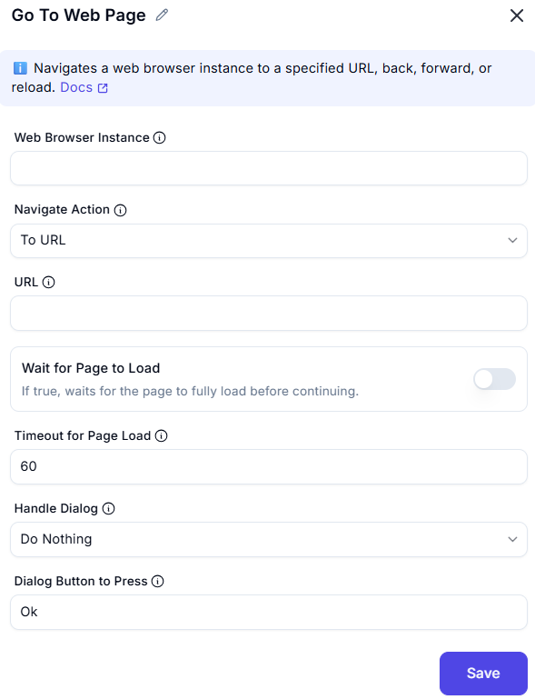

# Go to Web Page  

## Description
This action allows users to navigate to a specified web page using an existing browser instance.  
It is useful for web automation tasks such as data extraction, form filling, and website interaction.  

  

## Fields and Options  

### 1. Web Browser Instance
- Select the browser instance where the navigation should occur.  
- Ensures automation takes place in the correct browser session.  

### 2. Navigate Action
- Choose the navigation mode (default: "To URL").  
- Allows users to specify how they want to navigate.  

### 3. URL
- Input the web address where the automation should navigate.  
- The toggle option ensures the automation waits for the page to load completely before proceeding.  

### 4. Wait for Page to Load
- If true, waits for the page to fully load before continuing.

### 5. Timeout for Page Load
- Maximum time in seconds to wait for the page to load.

### 6. Handle Dialog
- Specifies what to do if a dialog appears after navigating.
- Do Nothing
- Press a Button
- Do Nothing
- Close it/Press a Button

### 4. Dialog Button to Press
- If a pop-up dialog appears, specify which button to press (e.g., "OK" or "Cancel").  
- Useful for handling alert dialogs during navigation.  

## Use Cases
- Automating web-based login procedures.  
- Navigating to a webpage to extract data.  
- Interacting with pop-ups and alerts on websites.  

## Summary
The **Go to Web Page** action provides a seamless way to automate web navigation.  
It ensures efficient handling of pop-ups and ensures web pages load fully before continuing.  