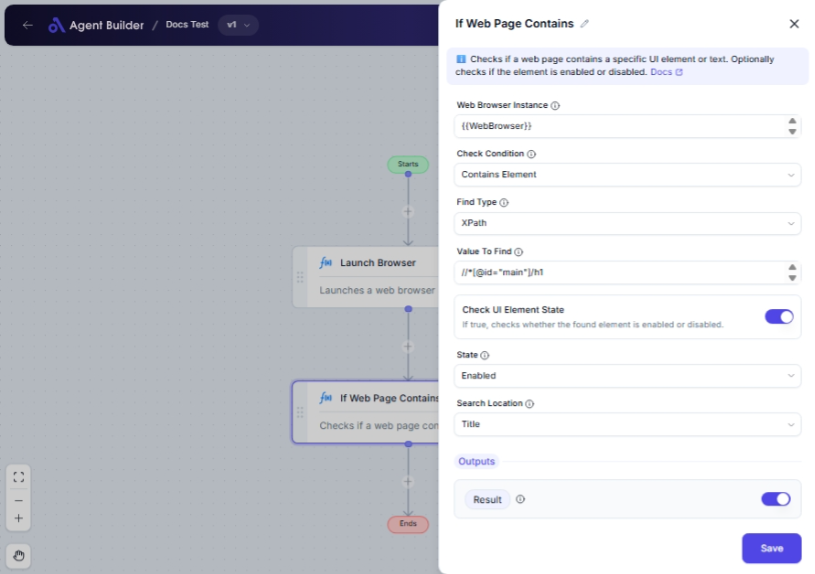

import { Callout, Steps } from "nextra/components";

# If Web Page Contains

The **If Web Page Contains** node is designed to help you verify the presence of specific elements or text within a web page using a configured browser instance. It's especially useful when you need to automate web tasks that depend on certain conditions being met, such as confirming a login success message or checking if a particular button exists on a page.

This node can determine if a web page:

- Contains or doesn't contain a specific UI element.
- Contains or doesn't contain a specific piece of text.

{/*  */}

## Configuration Options

| Field Name                 | Description                                                                                 | Input Type | Required? | Default Value   |
| -------------------------- | ------------------------------------------------------------------------------------------- | ---------- | --------- | --------------- |
| **Web Browser Instance**   | Enter or choose the variable that contains the web browser instance to work with.           | Text       | Yes       | _(empty)_       |
| **Check Condition**        | Specifies the condition to check (e.g., contains element, contains text).                   | Select     | Yes       | ContainsElement |
| **Find Type**              | Specifies how to find the element (only applicable for element conditions).                 | Select     | No        | XPath           |
| **Value To Find**          | The value used to locate the element.                                                       | Text       | No        | _(empty)_       |
| **Check UI Element State** | If true, checks whether the found element is enabled or disabled.                           | Switch     | No        | false           |
| **State**                  | Specifies the expected state of the element (enabled or disabled).                          | Select     | No        | Enabled         |
| **Text To Search**         | The text to search for in the web page body or title (only applicable for text conditions). | Text       | No        | _(empty)_       |
| **Search Location**        | Specifies where to search for the text (e.g., Body, Title).                                 | Select     | No        | Body            |

## Expected Output Format

The output of this node is a **boolean value**, which is either **true** or **false**.

- **true** if the specified condition is met.
- **false** if the condition is not met.

This result will be available as **Result** and can be used in subsequent nodes to control the flow based on the check condition.

## Step-by-Step Guide

<Steps>
### Step 1

Add **If Web Page Contains** node into your flow.

### Step 2

In the **Web Browser Instance** field, enter or select the variable containing your web browser instance.

### Step 3

Select a condition from the **Check Condition** dropdown, depending on whether you want to check for an element or text on the page.

- **Contains Element**: Checks if a specific UI element is present.
- **Doesn't Contain Element**: Checks if a specific UI element is absent.
- **Contains Text**: Checks if specific text is present.
- **Doesn't Contain Text**: Checks if specific text is absent.

### Step 4

If you selected an element-based condition, configure the following fields:

- **Find Type**: Choose how to locate the element (e.g., XPath, ID).
- **Value To Find**: Enter the element locator value (e.g., XPath query).

### Step 5

Optionally, toggle **Check UI Element State** if you need to verify the element's enabled/disabled state, then select the **State** expectation (Enabled/Disabled).

### Step 6

If you selected a text-based condition, enter the text you are searching for in **Text To Search** and specify **Search Location** (Body or Title).

### Step 7

The output will be available as **Result**, which will be true if the condition is met and false otherwise.

</Steps>

<Callout type="info" title="Note">
  Make sure that the web browser instance is properly configured and active for
  accurate checks.
</Callout>

## Input/Output Examples

| Check Condition      | Value/Element          | Find Type | Search Location | Output Value | Output Type |
| -------------------- | ---------------------- | --------- | --------------- | ------------ | ----------- |
| Contains Element     | `//input[@id='email']` | XPath     | _(n/a)_         | true         | Boolean     |
| Doesn't Contain Text | `Welcome User`         | _(n/a)_   | Body            | false        | Boolean     |
| Contains Text        | `Dashboard`            | _(n/a)_   | Title           | true         | Boolean     |

## Common Mistakes & Troubleshooting

| Problem                                    | Solution                                                                                          |
| ------------------------------------------ | ------------------------------------------------------------------------------------------------- |
| **Invalid Web Browser Instance**           | Ensure the web browser instance variable is correctly referenced and active.                      |
| **No output despite condition being true** | Double-check the element locator or text for accuracy.                                            |
| **Misconfigured element search fields**    | Ensure **Find Type** and **Value To Find** are correctly set when "Contains Element" is selected. |

## Real-World Use Cases

- **Login Validation**: Check if a login confirmation message is visible.
- **Checkout Process**: Verify if a "Place Order" button exists before processing.
- **Content Verification**: Ensure a web page contains specific informational text before proceeding.
- **Error Handling**: Detect specific error messages on a page to trigger alternative workflows.
