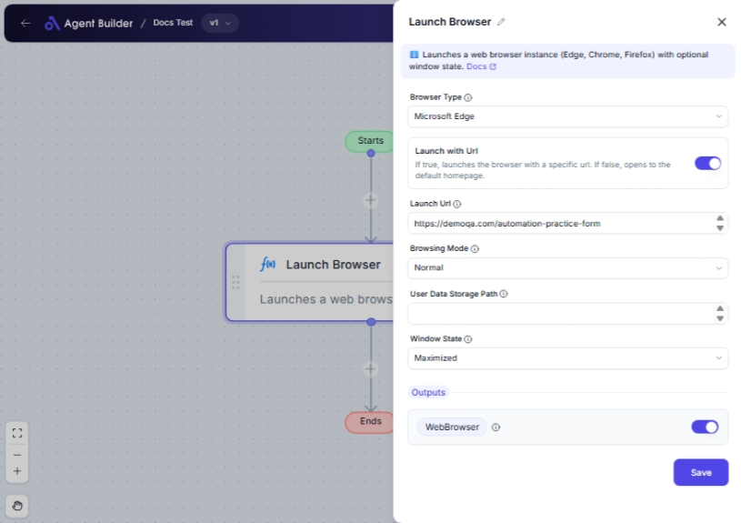

import { Callout, Steps } from "nextra/components";

# Launch Browser

The **Launch Browser** node is designed to initiate a web browser and set it up for further automation tasks. This node is essential for executing web-based workflows, such as testing scenarios, scraping data, and automating web page interactions. You can choose between popular browsers like Microsoft Edge, Google Chrome, or Mozilla Firefox, and configure how the browser behaves upon launch.

Whether you're planning to open a browser to its default homepage or a specific URL, this node provides flexible options to suit your needs.

{/*  */}

## Configuration Options

| Field Name                  | Description                                                                                      | Input Type | Required? | Default Value |
| --------------------------- | ------------------------------------------------------------------------------------------------ | ---------- | --------- | ------------- |
| **Browser Type**            | Specifies which browser to launch (e.g., Microsoft Edge, Google Chrome, Mozilla Firefox).        | Select     | Yes       | MicrosoftEdge |
| **Launch with Url**         | Decide if the browser should open a specific URL or its default homepage.                        | Switch     | No        |               |
| **Launch Url**              | URL to open if "Launch with Url" is enabled. Otherwise, opens the default homepage.              | Text       | No        |               |
| **Browsing Mode**           | Choose how the browser operates: normal or private/incognito mode.                               | Select     | No        | Normal        |
| **User Data Storage Path**  | Path to store browser data, such as user profiles. Handy if storing data in a specific location. | Text       | No        |               |
| **Custom Browser Name**     | Specify custom browser name, needed if "Browser Type" is set to "Custom".                        | Text       | No        |               |
| **Browser Executable Path** | Path to the custom browser executable, applicable if "Browser Type" is "Custom".                 | Text       | No        |               |
| **Driver Executable Path**  | Path to the driver executable, needed for custom browsers.                                       | Text       | No        |               |
| **Window State**            | Defines the initial window state (maximized, minimized, or normal) of the launched browser.      | Select     | No        | Maximized     |

## Expected Output Format

By default, the output from this node is a **Web Browser** object, represented by **WebBrowser**. This can be used in subsequent automation steps to interact with the browser programmatically.

## Step-by-Step Guide

<Steps>
### Step 1

Add a **Launch Browser** node to your workflow.

### Step 2

Select your preferred **Browser Type** from the dropdown menu:

- **Microsoft Edge**
- **Google Chrome**
- **Mozilla Firefox**
- Or select **Custom** for other browsers by specifying additional paths.

### Step 3

Choose **Launch with Url** if you want the browser to open a specific web page. Enter the URL in the **Launch Url** field.

### Step 4

Decide on the **Browsing Mode**:

- **Normal** for regular browsing.
- **Private** to prevent saving history or cookies.

### Step 5

If needed, input a **User Data Storage Path** to control where browser data is saved.

### Step 6

For a **Custom** browser, provide the **Custom Browser Name**, **Browser Executable Path**, and **Driver Executable Path**.

### Step 7

Set the **Window State** to how you want the browser window to open:

- **Maximized**
- **Minimized**
- **Normal**

### Step 8

Use the **WebBrowser** object in subsequent nodes for further interactions.

</Steps>

<Callout type="info" title="Note">
  If selecting **Custom** as the browser, ensure you have the correct browser
  and driver paths set up to avoid launch failures.
</Callout>

## Input/Output Examples

| Example Scenario     | Browser Type   | Launch with Url | Launch Url              | Browsing Mode | Window State | Output Value | Output Type |
| -------------------- | -------------- | --------------- | ----------------------- | ------------- | ------------ | ------------ | ----------- |
| Use Google Chrome    | Google Chrome  | Yes             | https://www.example.com | Normal        | Maximized    | WebBrowser   | Object      |
| Open with no URL     | Microsoft Edge | No              | _(none)_                | Private       | Normal       | WebBrowser   | Object      |
| Custom browser usage | Custom         | Yes             | https://www.custom.com  | Normal        | Maximized    | WebBrowser   | Object      |

## Common Mistakes & Troubleshooting

| Problem                                | Solution                                                                                                           |
| -------------------------------------- | ------------------------------------------------------------------------------------------------------------------ |
| **No output or browser not launching** | Ensure you've selected a valid **Browser Type** and all necessary custom paths are entered correctly.              |
| **Launch Url not working**             | Double-check if **Launch with Url** is enabled and **Launch Url** is correctly entered.                            |
| **Incorrect window state**             | Confirm the **Window State** is set correctly, especially if the browser opens in a different state than expected. |

## Real-World Use Cases

- **Website Testing**: Launch different browsers to test website compatibility across various platforms.
- **Data Scraping**: Automate data extraction from websites by opening and navigating through pages.
- **Automated Logins**: Use in workflows to log into sites automatically, particularly helpful in batch processing tasks.
- **Private Browsing Sessions**: Open browsers in private mode for security-focused tasks, avoiding data and history tracking.
