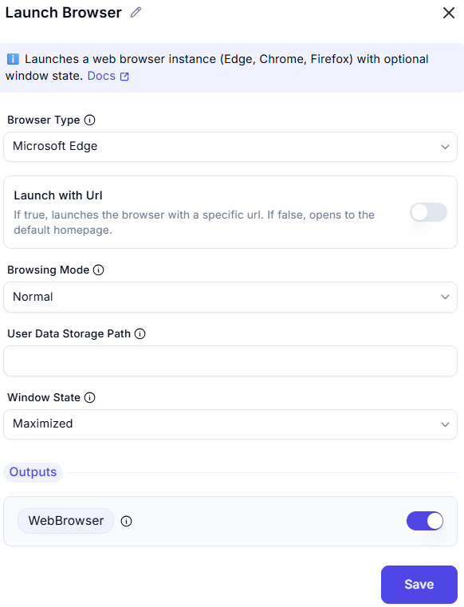

# Launch Browser

## Description
This feature allows users to launch a new instance of Google Chrome or attach to an existing tab. It includes options to configure the launch mode, initial URL, tab title, and window state.  

  

## Fields and Options  

### 1. **Browser Type**
- Choose how to launch:  
  - Specifies which browser to launch (Microsoft Edge, Google Chrome, Mozilla Firefox).

### 2. **Launch with Url**
- If true, launches the browser with a specific url. If false, opens to the default homepage.

### 3. **Browsing Mode**
- Specifies whether to open in normal or private browsing mode.

### 4. **User Data Storage Path**
- Path to store browser data (e.g., user profiles). Required if need for store data somewhere else.

### 5. **Window State**
- Choose the initial state of the Chrome window:  
  - **Normal**: Open the window in its default state.  
  - **Maximized**: Open the window in a maximized state.  
  - **Minimized**: Open the window in a minimized state.  

## Use Cases
- Launching a new instance of Chrome for automation tasks.  
- Attaching to an existing Chrome tab to continue automation.  
- Configuring the initial URL and window state for better control over the browser session.  

## Summary
The **Launch New Chrome** action provides a way to launch or attach to Chrome with customizable options like launch mode, initial URL, tab title, and window state. It ensures flexibility and control when working with Chrome in automation workflows.