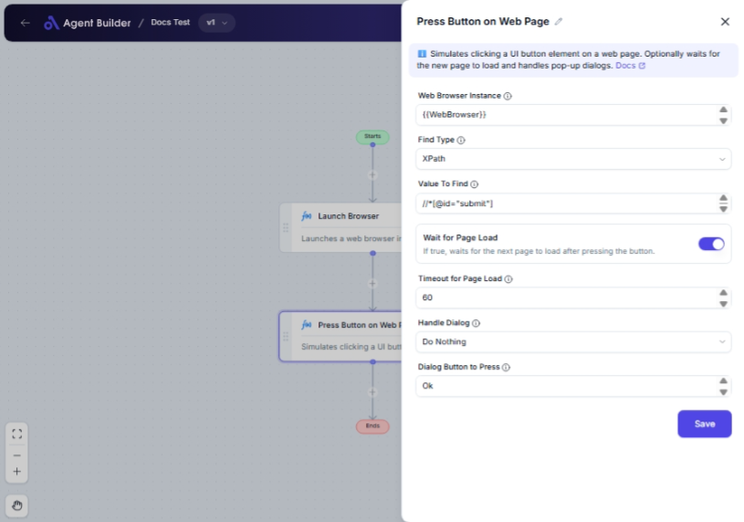

import { Callout, Steps } from "nextra/components";

# Press Button on Web Page

The **Press Button on Web Page** node enables you to automate the clicking of a button on a web page within a designated web browser instance. This is ideal for scenarios where you need to simulate a button press, such as submitting forms, logging into a website, or navigating between pages automatically.

{/*  */}

## Configuration Options

| Field Name                 | Description                                                                       | Input Type | Required? | Default Value |
| -------------------------- | --------------------------------------------------------------------------------- | ---------- | --------- | ------------- |
| **Web Browser Instance**   | Enter or choose the variable that contains the web browser instance to work with. | Text       | Yes       | _(empty)_     |
| **Find Type**              | Specifies how to find the element (e.g., ID, XPath, CSS Selector).                | Select     | Yes       | XPath         |
| **Value To Find**          | The value used to locate the element (e.g., 'username', '//input[@id='email']').  | Text       | Yes       | _(empty)_     |
| **Wait for Page Load**     | If true, waits for the next page to load after pressing the button.               | Switch     | No        | True          |
| **Timeout for Page Load**  | Maximum time in seconds to wait for the page to load.                             | Text       | No        | 60            |
| **Handle Dialog**          | Specifies what to do if a dialog appears after the click.                         | Select     | No        | DoNothing     |
| **Dialog Button to Press** | The name of the button to press if a dialog appears (e.g., 'Ok', 'Cancel').       | Text       | No        | Ok            |

## Expected Output Format

The output does not involve a specific data value being returned; rather, the operation will execute as defined—pressing a button or interacting with any dialog that appears.

## Step-by-Step Guide

<Steps>
### Step 1

Add the **Press Button on Web Page** node to your flow.

### Step 2

In the **Web Browser Instance** field, specify the browser instance variable that you are working with.

### Step 3

Select the **Find Type** from the dropdown menu to define how the button on the page will be located. Options include XPath, Id, Css Selector, among others.

### Step 4

In the **Value To Find** field, enter the specific path or identifier for the button you wish to press.

### Step 5

(Optional) If you want the process to wait for the next page to load after pressing the button, ensure **Wait for Page Load** is set to True, and define a **Timeout for Page Load** in seconds.

### Step 6

(Optional) Configure **Handle Dialog** if you anticipate a dialog appearing after the button press, and specify the **Dialog Button to Press** if applicable.

### Step 7

Complete your flow, and the configuration will act upon executing to press the intended button.

</Steps>

<Callout type="info" title="Tip">
  Ensure the web browser instance is correctly initialized and active to avoid
  errors during the button press operation.
</Callout>

## Common Mistakes & Troubleshooting

| Problem                | Solution                                                                                                         |
| ---------------------- | ---------------------------------------------------------------------------------------------------------------- |
| **Button not found**   | Verify the correctness of the **Find Type** and **Value To Find** fields, ensuring they match the page elements. |
| **Page Load Timeout**  | Increase the **Timeout for Page Load** if the webpage takes longer than expected to load.                        |
| **Dialog not handled** | Double-check your **Handle Dialog** setting and ensure the dialog elements are recognized correctly.             |

## Real-World Use Cases

- **Automatic Form Submission**: Automate the pressing of a "Submit" button after fields are populated.
- **Website Login Automation**: Simulate clicking the "Login" button on a sign-in screen.
- **Navigation**: Automatically move to the next page of multi-step forms or applications by pressing the "Next" button.
