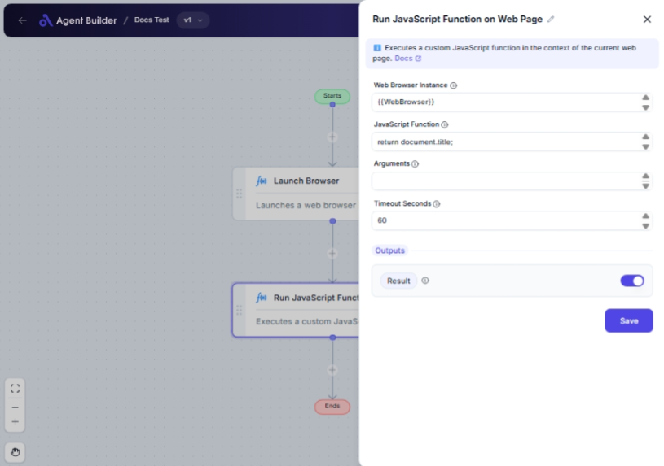

import { Callout, Steps } from "nextra/components";

# Run JavaScript Function on Web Page

The **Run JavaScript Function on Web Page** node allows you to execute a JavaScript function directly on a web page that's being accessed through a web browser instance. This is useful for interacting with or retrieving data from the page using JavaScript technology.

You might use this node to:

- Retrieve content or elements from the page by executing JavaScript.
- Modify web page content dynamically without manual browsing.
- Automate data extraction or interaction processes on web pages.

## Configuration Options

| Field Name               | Description                                                                                    | Input Type | Required? | Default Value |
| ------------------------ | ---------------------------------------------------------------------------------------------- | ---------- | --------- | ------------- |
| **Web Browser Instance** | Enter or choose the variable that contains the web browser instance to work with.              | Text       | Yes       | _(empty)_     |
| **JavaScript Function**  | The JavaScript function to execute (e.g., `'document.getElementById("myId").value = "test";'`) | Text       | Yes       | _(empty)_     |
| **Arguments**            | Optional arguments to pass to the script function.                                             | Text       | No        | _(empty)_     |
| **Timeout Seconds**      | Maximum time in seconds to wait for script execution before failing.                           | Text       | No        | 60            |

## Expected Output Format

The output of this node is **Result**, which returns the result of the JavaScript execution if any is expected. The type of this output is typically the same as the return type of the JavaScript function executed, which could be a string, number, boolean, array, or object.

## Step-by-Step Guide

<Steps>

### Step 1

Add **Run JavaScript Function on Web Page** node into your flow.

### Step 2

In the **Web Browser Instance** field, input the browser instance variable name that you are working with.

### Step 3

Input your JavaScript code in the **JavaScript Function** field. Ensure it is properly formatted JavaScript syntax.

### Step 4

If your function requires arguments, enter them in the **Arguments** field. This is optional.

### Step 5

Set your desired time in seconds in the **Timeout Seconds** field, indicating how long to wait for the script execution before timing out.

### Step 6

Execute the flow. The result from running the JavaScript will be accessible through **Result**.

</Steps>

<Callout type="warning" title="Important">
  Ensure the JavaScript function is correctly formatted and does not contain
  unsafe code, as it will run on the browser instance and could potentially
  alter web page data.
</Callout>

## Input/Output Examples

| JavaScript Function                             | Arguments | Timeout Seconds | Expected Result Output | Output Type |
| ----------------------------------------------- | --------- | --------------- | ---------------------- | ----------- |
| `return document.title;`                        | _(none)_  | 60              | "Home - My Web App"    | String      |
| `document.body.style.backgroundColor = "blue";` | _(none)_  | 30              | undefined              | Undefined   |
| `return document.getElementById("myId").value;` | _(none)_  | 45              | "Sample Value"         | String      |

## Common Mistakes & Troubleshooting

| Problem                                            | Solution                                                                                                                                       |
| -------------------------------------------------- | ---------------------------------------------------------------------------------------------------------------------------------------------- |
| **'Web Browser Instance' field is empty**          | Ensure you have the correct and active web browser instance set for this node.                                                                 |
| **JavaScript syntax error in function field**      | Double-check the JavaScript syntax. Errors in code can cause the script to not execute.                                                        |
| **No result even when a return statement is used** | Make sure the JavaScript function is correctly set to return a value. Check if the browser context meets the expected state to produce output. |

## Real-World Use Cases

- **Automate Information Retrieval**: Execute scripts to extract current page titles or scrape specific elements' text content.
- **Modify Browser Content**: Change page styles or content dynamically (e.g., change a div's background color for visibility during tests).
- **Testing and Automation**: Automate JavaScript-based tests or interactions on the page to ensure functionality, such as form submissions or validations.
