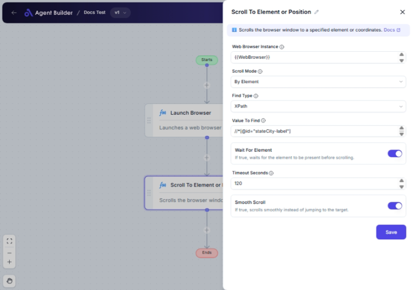

import { Callout, Steps } from "nextra/components";

# Scroll To Element or Position

The **Scroll To Element or Position** node allows you to programmatically scroll within a web browser to a specific element on a page or to a precise (X,Y) coordinate. This is particularly useful when dealing with dynamic or lengthy web pages where accessing a particular part of the content requires scrolling.

For example:

- Automatically scrolling to a login form for a user to input credentials.
- Navigating to a specific position on a page based on its layout.

## Configuration Options

| Field Name               | Description                                                                                                                | Input Type | Required? | Default Value |
| ------------------------ | -------------------------------------------------------------------------------------------------------------------------- | ---------- | --------- | ------------- |
| **Web Browser Instance** | Enter or choose the variable that contains the web browser instance to work with.                                          | Text       | Yes       | _(empty)_     |
| **Scroll Mode**          | Specifies how to scroll: by element or by coordinates.                                                                     | Select     | No        | ByElement     |
| **Find Type**            | Specifies how to find the element (e.g., ID, XPath, CssSelector). _Appears if Scroll Mode is "By Element"._                | Select     | Yes       | XPath         |
| **Value To Find**        | The value used to locate the element (e.g., 'username', '//input[@id='email']'). _Appears if Scroll Mode is "By Element"._ | Text       | No        | _(empty)_     |
| **X Coordinate**         | Horizontal scroll position. Only used in 'By Coordinates' mode.                                                            | Text       | No        | _(empty)_     |
| **Y Coordinate**         | Vertical scroll position. Only used in 'By Coordinates' mode.                                                              | Text       | No        | _(empty)_     |
| **Wait For Element**     | If true, waits for the element to be present before scrolling.                                                             | Switch     | No        | _(empty)_     |
| **Timeout Seconds**      | Maximum time in seconds to wait for the element before failing.                                                            | Text       | No        | 60            |
| **Smooth Scroll**        | If true, scrolls smoothly instead of jumping to the target.                                                                | Switch     | No        | _(empty)_     |

## Expected Output Format

The output of this node is a **boolean value** indicating whether the scroll action was successful without any errors.

## Step-by-Step Guide

<Steps>
### Step 1

Add a **Scroll To Element or Position** node into your flow.

### Step 2

In the **Web Browser Instance** field, enter or select the browser instance variable you wish to use.

### Step 3

Choose the **Scroll Mode**:

- **By Element**: Scroll to a specific UI element on the page.
- **By Coordinates**: Scroll to a specific (X,Y) position on the page.

### Step 4

If you chose **By Element**:

- Set the **Find Type** to specify how you'd like to locate the element (e.g., XPath, Id, Css Selector).
- Enter the **Value To Find**, which indicates the specific element you want to scroll to.

### Step 5

If you chose **By Coordinates**:

- Enter the **X Coordinate** for the horizontal position.
- Enter the **Y Coordinate** for the vertical position.

### Step 6

(Optional) If you want to ensure the element is present before scrolling, set **Wait For Element** to true and specify **Timeout Seconds**.

### Step 7

(Optional) If you prefer smooth scrolling, enable the **Smooth Scroll** option.

</Steps>

<Callout type="info" title="Tip">
  If using "Smooth Scroll", the scrolling action will appear more fluid, which
  is ideal for enhancing user experience.
</Callout>

## Input/Output Examples

| Scroll Mode    | Find Type | Value To Find        | X Coordinate | Y Coordinate | Smooth Scroll | Output Value | Output Type |
| -------------- | --------- | -------------------- | ------------ | ------------ | ------------- | ------------ | ----------- |
| By Element     | XPath     | //div[@id='content'] | _(n/a)_      | _(n/a)_      | true          | true         | Boolean     |
| By Coordinates | _(n/a)_   | _(n/a)_              | 100          | 200          | false         | true         | Boolean     |

## Common Mistakes & Troubleshooting

| Problem                                          | Solution                                                                                                                                                                     |
| ------------------------------------------------ | ---------------------------------------------------------------------------------------------------------------------------------------------------------------------------- |
| **Element not found when using By Element mode** | Confirm the accuracy of **Find Type** and **Value To Find**. You might need to review the element's actual HTML attributes or structure.                                     |
| **Coordinates do not match**                     | Ensure that the coordinates are visible and accessible within the web page layout. Incorrect X/Y values may lead to scrolling to a part of the page that is not interactive. |
| **Scrolling not smooth**                         | Check and toggle the **Smooth Scroll** option for smoother transitions.                                                                                                      |
| **Timeout expired when waiting for element**     | Adjust **Timeout Seconds** as needed. Web pages with heavy content might require more time to load elements.                                                                 |

## Real-World Use Cases

- **E-Learning Platforms**: Automatically scroll to a video or lesson section so that students can immediately begin their learning without manual navigation.
- **E-Commerce**: Smoothly scroll to a product detail section from a search results page, enhancing the shopping experience for users.
- **Web Automation Testing**: Automate testing scenarios by navigating to various sections of a web page effortlessly.
- **Customer Support**: Quickly move between different areas of a support dashboard to address specific issues reported by users.
