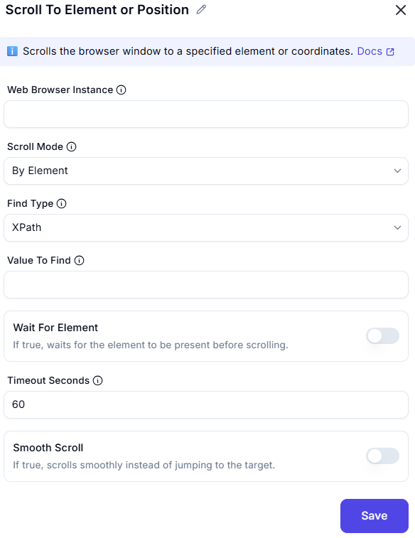

# Scroll To Element or Position

This action scrolls the browser window to a **specified element** or **exact coordinates** on a webpage.

  

---

### Configuration Fields

| Field                  | Description                                                                 |
|------------------------|-----------------------------------------------------------------------------|
| **Web Browser Instance** | The active web browser session where the scroll action will be performed. |
| **Scroll Mode**          | Mode of scrolling: `By Element` or `By Position`.                         |
| **Find Type**            | How to locate the element (e.g., `XPath`, `CSS Selector`, etc.).          |
| **Value To Find**        | The locator value (XPath/CSS/etc.) used to identify the target element.   |
| **Wait For Element**     | If enabled, waits until the element is present before scrolling.           |
| **Timeout Seconds**      | Max time to wait for the element to appear (default: 60 seconds).         |
| **Smooth Scroll**        | If enabled, scrolls smoothly rather than jumping instantly.               |

---

### Scroll Modes

- `By Element`: Scrolls the page to bring the specified element into view.
- `By Position`: Scrolls to specific X, Y coordinates (not shown in this config).

---

### Example Use Case

**Goal:** Scroll to a login form.

| Parameter           | Value                            |
|---------------------|----------------------------------|
| Scroll Mode         | By Element                       |
| Find Type           | XPath                            |
| Value To Find       | `//form[@id='login-form']`       |
| Wait For Element    | ✅ Enabled                        |
| Timeout Seconds     | 60                               |
| Smooth Scroll       | ✅ Enabled                        |

---

### Tips

- Always ensure the element is present and visible before scrolling.
- Use **Smooth Scroll** for a natural user experience in demo or UI testing flows.
- If scrolling to coordinates, make sure elements do not dynamically shift positions.

---

### Summary

The **Scroll To Element or Position** action enhances automation by ensuring specific parts of the page are visible and interactable. It's useful in automating UI interactions, screenshots, and visibility-based validations.
