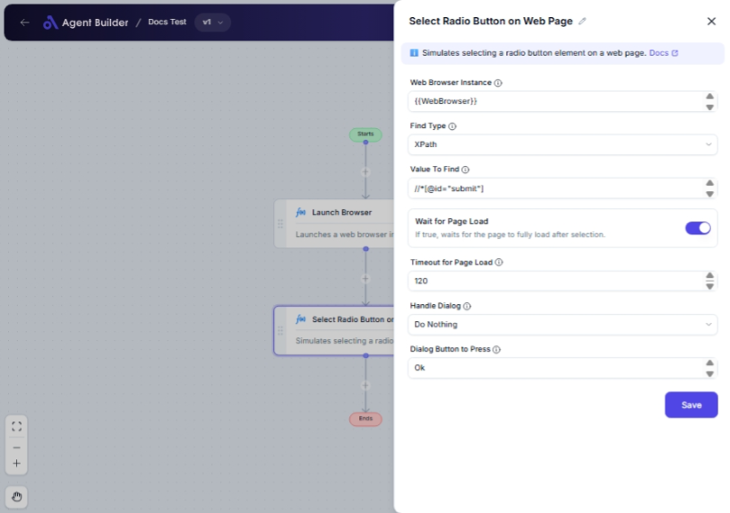

import { Callout, Steps } from "nextra/components";

# Select Radio Button on Web Page

The **Select Radio Button on Web Page** node helps you automate the task of selecting a radio button on a webpage. This is especially useful when filling out forms or performing tasks that require interaction with web elements to automate workflows efficiently.

This node allows you to specify how to locate the radio button using various methods, such as XPath or CSS Selector, and provides options to handle pop-up dialogs if they appear, ensuring a seamless automation experience.

{/*  */}

## Configuration Options

| Field Name                 | Description                                                                                                                              | Input Type | Required? | Default Value |
| -------------------------- | ---------------------------------------------------------------------------------------------------------------------------------------- | ---------- | --------- | ------------- |
| **Web Browser Instance**   | Enter or choose the variable that contains the web browser instance to work with.                                                        | Text       | Yes       | _(empty)_     |
| **Find Type**              | Specifies how to find the element (e.g., ID, XPath, CssSelector).                                                                        | Select     | Yes       | XPath         |
| **Value To Find**          | The value used to locate the element (e.g., 'username', '//input[@id='email']').                                                         | Text       | Yes       | _(empty)_     |
| **Wait for Page Load**     | If true, waits for the page to fully load after selection.                                                                               | Switch     | No        | true          |
| **Timeout for Page Load**  | Maximum time in seconds to wait for the page to load.                                                                                    | Text       | No        | 60            |
| **Handle Dialog**          | Specifies what to do if a dialog appears after selecting the radio button.                                                               | Select     | No        | DoNothing     |
| **Dialog Button to Press** | The name of the button to press if a dialog appears (e.g., 'Ok', 'Cancel'). _Relevant if "Press a Button" is selected in Handle Dialog._ | Text       | No        | Ok            |

## Expected Output Format

This node does not produce an output value directly but performs an action on the webpage. The outcome is the successful selection of the specified radio button on a web page.

## Step-by-Step Guide

<Steps>
### Step 1

Add **Select Radio Button on Web Page** node into your flow.

### Step 2

In the **Web Browser Instance** field, enter or select the variable that contains your active web browser session.

### Step 3

Select a **Find Type** from the dropdown to determine how the radio button will be located on the webpage.

### Step 4

Enter the **Value To Find** that corresponds to the method chosen in the previous step. This is typically a selector string, such as an XPath expression or a CSS selector.

### Step 5

(Optional) Set **Wait for Page Load** switch to true if you want the node to wait for the webpage to load completely after selecting the radio button.

### Step 6

(Optional) Specify the **Timeout for Page Load** in seconds if you opted to wait for the page to load.

### Step 7

(Optional) Choose how to **Handle Dialog** if a pop-up appears after selection. You might opt to close it, press a button, or do nothing.

### Step 8

If you selected **Press a Button** for handling dialogs, specify the **Dialog Button to Press**.

</Steps>

<Callout type="warning" title="Important">
  Ensure that your web browser instance is active and the webpage is accessible
  to avoid errors.
</Callout>

## Common Mistakes & Troubleshooting

| Problem                                     | Solution                                                                                                |
| ------------------------------------------- | ------------------------------------------------------------------------------------------------------- |
| **Element not found**                       | Verify the **Find Type** and **Value To Find** are correct and match an existing radio button.          |
| **Page load timeout**                       | Increase the **Timeout for Page Load** if the webpage is slow to load or consider optimizing the page.  |
| **Dialog handling not working as expected** | Check if the **Handle Dialog** option is correctly set. Ensure dialogs can be programmatically handled. |

## Real-World Use Cases

- **Automated Form Submission**: Automatically select specific options within web forms for batch processing or testing.
- **Web Testing**: Simulate user actions during automated testing to validate web application behavior.
- **Data Entry Automation**: Streamline data entry tasks by pre-selecting options on a client or internal portal.
