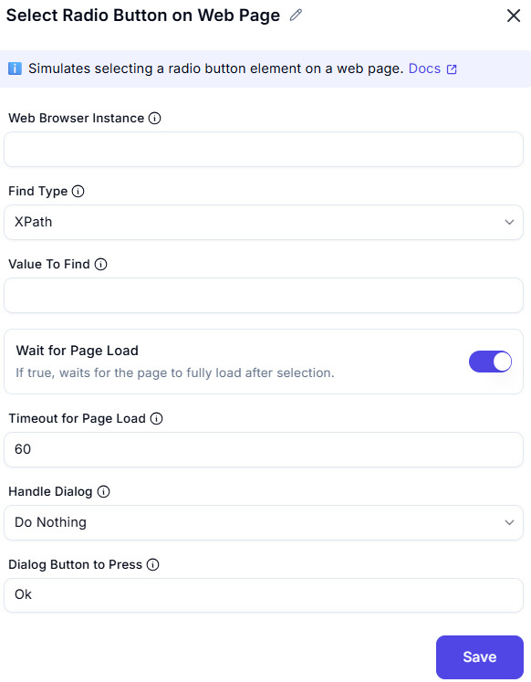

# Select Radio Button on Web Page  

## Description
This feature allows users to select a radio button (UI element) on a web page within a web browser instance. It includes options to wait for the page to load and handle pop-up dialogs if they appear.  

  

## Fields and Options  

### 1. Web Browser Instance 
- Select the web browser instance where the radio button is located.  
- This ensures the action is performed on the correct browser session.  

### 2. Find Type
- Specify the radio button (UI element) to select.  

### 3. Value To find
- The value used to locate the element (e.g., 'username', '//input[@id='email']').
 
### 4. Wait for Page to Load
- Enable this option to wait for the web page to load completely after selecting the radio button.  

### 5. Timeout for Page Load
- Set the maximum time (in seconds) to wait for the page to load (e.g., `60` seconds).  

### 6. Handle Dialog
- Choose how to handle pop-up dialogs:  
  - **Do Nothing**: Ignore the pop-up dialog.  
  - **Dialog Button to Press**: Specify a button to press on the pop-up dialog (e.g., `OK`, `Cancel`).  

## Use Cases
- Automating form interactions by selecting radio buttons.  
- Ensuring the web page is fully loaded before proceeding with further actions.  
- Handling pop-up dialogs that may appear after selecting a radio button.  

## Summary
The **Select Radio Button on Web Page** action provides a way to select a radio button on a web page, with options to wait for the page to load and handle pop-up dialogs. It ensures smooth and reliable interaction with web elements during automation workflows.  