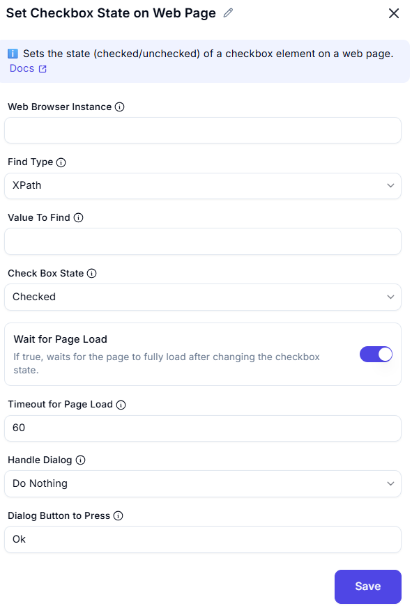

## Set Checkbox State on Web Page
This action sets the **checked** or **unchecked** state of a checkbox element on a web page using browser automation.

---
  

### Configuration Fields

| Field                    | Description                                                                 |
|--------------------------|-----------------------------------------------------------------------------|
| **Web Browser Instance** | The browser session instance where the checkbox element exists.             |
| **Find Type**            | The strategy to locate the checkbox element on the page (e.g., XPath, CSS). |
| **Value to Find**        | The selector or identifier for the checkbox element.                        |
| **Check Box State**      | The desired state: `Checked` or `Unchecked`.                                |
| **Wait for Page Load**   | If enabled, waits until the page fully loads after setting the state.       |
| **Timeout for Page Load**| Maximum time (in seconds) to wait for page to load (default: 60 seconds).   |
| **Handle Dialog**        | Specifies how to handle pop-up dialogs (e.g., alert/confirm).               |
| **Dialog Button to Press**| If a dialog appears, this specifies which button to press (e.g., `OK`).     |

---              |

### Behavior Flow

```text
1. Launch the specified browser instance.
2. Locate the checkbox using the given selector type and value.
3. Set the checkbox to Checked/Unchecked as per configuration.
4. If "Wait for Page Load" is enabled, it will wait for the page to reload after change.
5. If a browser dialog appears, handle it based on the dialog settings.

## Summary
This node provides precise control over checkbox states on a web page, essential for tasks such as:
Accepting terms and conditions
Enabling/disabling settings
Controlling feature flags in UI-based automation