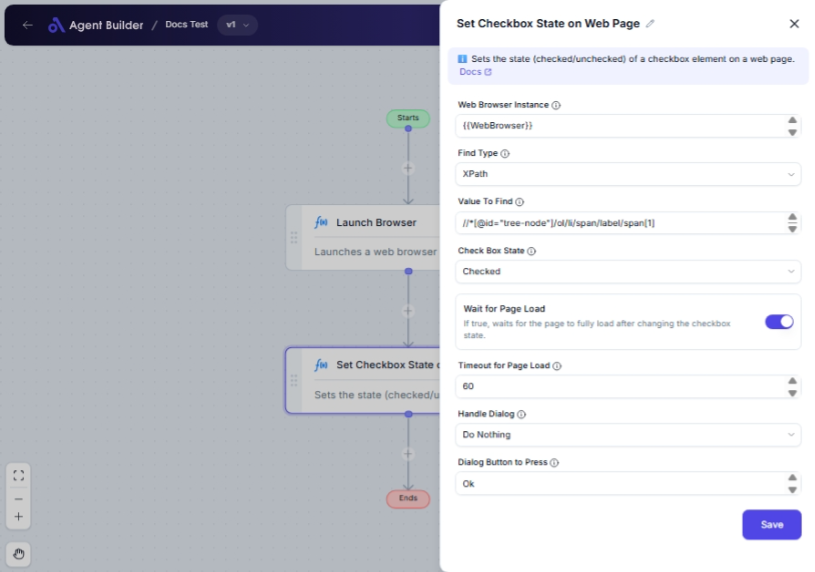

import { Callout, Steps } from "nextra/components";

# Set Checkbox State on Web Page

The **Set Checkbox State on Web Page** node is designed to automate the process of checking or unchecking a checkbox on a web page. This can be particularly useful for web-based forms or applications where you need to toggle a checkbox as part of a larger automation task.

{/*  */}

## Configuration Options

| Field Name                 | Description                                                                                 | Input Type | Required? | Default Value |
| -------------------------- | ------------------------------------------------------------------------------------------- | ---------- | --------- | ------------- |
| **Web Browser Instance**   | Enter or choose the variable that contains the web browser instance to work with.           | Text       | Yes       | _(empty)_     |
| **Find Type**              | Choose how to find the checkbox element (e.g., ID, XPath, CssSelector).                     | Select     | Yes       | XPath         |
| **Value To Find**          | Specify the value used to locate the checkbox (e.g., `username` or `//input[@id='email']`). | Text       | Yes       | _(empty)_     |
| **Check Box State**        | Select whether to set the checkbox as checked or unchecked.                                 | Select     | Yes       | Checked       |
| **Wait for Page Load**     | Decide whether to wait for the page to load fully after changing the checkbox state.        | Switch     | No        | true          |
| **Timeout for Page Load**  | Define the maximum wait time in seconds for the page to load.                               | Text       | No        | 60            |
| **Handle Dialog**          | Specify what action to take if a dialog appears after setting the checkbox.                 | Select     | No        | DoNothing     |
| **Dialog Button to Press** | Name the button to press if handling a dialog (e.g., `Ok`, `Cancel`).                       | Text       | No        | Ok            |

## Expected Output Format

This node does not output a value. Its primary function is to change the state of a checkbox on a web page in the existing workflow.

## Step-by-Step Guide

<Steps>
### Step 1

Add the **Set Checkbox State on Web Page** node into your flow.

### Step 2

In the **Web Browser Instance** field, enter or select the variable representing the web browser instance you are using.

### Step 3

Use the **Find Type** dropdown to choose how you will locate the checkbox on the web page. Options include XPath, ID, CssSelector, and more.

### Step 4

Enter the identifier value in **Value To Find** that corresponds with your chosen Find Type, for example, an XPath expression or an HTML ID string.

### Step 5

Select either **Checked** or **Unchecked** in the **Check Box State** dropdown to set the desired checkbox state.

### Step 6

If you want the automation to wait for the page to load after changing the checkbox status, toggle the **Wait for Page Load** switch. Adjust the **Timeout for Page Load** value if necessary to increase or decrease the wait time from the default of 60 seconds.

### Step 7

Determine your preferred **Handle Dialog** option if a dialog box might appear post-action.

### Step 8

If choosing to interact with a dialog, specify which button to press in **Dialog Button to Press**.

</Steps>

<Callout type="info" title="Note">
  Only set the **Dialog Button to Press** if you chose "Press a Button" or
  "Close It / Press a Button" in the **Handle Dialog** dropdown.
</Callout>

## Common Mistakes & Troubleshooting

| Problem                      | Solution                                                                                                                   |
| ---------------------------- | -------------------------------------------------------------------------------------------------------------------------- | --- |
| **Checkbox not found**       | Verify the **Find Type** and **Value To Find** are correctly set for locating the checkbox.                                |
| **Page does not fully load** | Ensure **Wait for Page Load** is enabled, or check network conditions. Increase **Timeout for Page Load** if necessary.    |
| **Dialog does not close**    | Double-check the **Handle Dialog** settings and ensure any buttons specified exist on the dialog presented by the webpage. |     |

## Real-World Use Cases

- **Web Form Automation**: Automatically check or uncheck terms and condition checkboxes for form submissions.
- **User Preferences Settings**: Adjust checkbox settings on a user account page according to preference inputs.
- **Testing Automation**: Facilitate testing scripts by programmatically changing checkbox states to verify different conditions.
