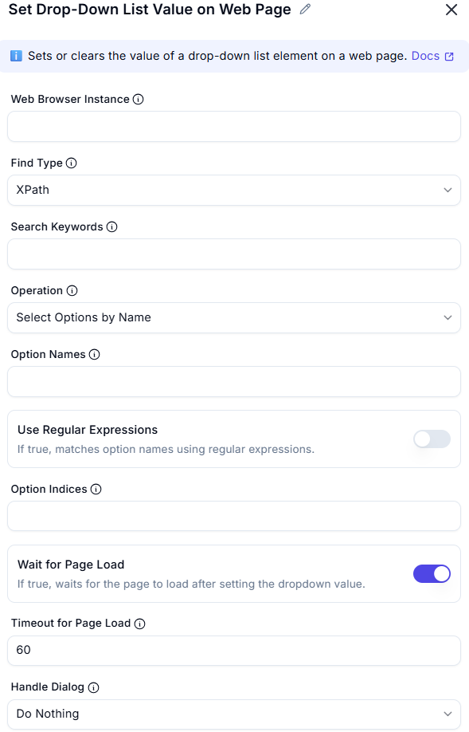

# Set Drop-Down List Value on Web Page

This action sets or clears the value of a drop-down (`<select>`) element on a web page via browser automation.

  

---

### Configuration Options

| Field                  | Description                                                                 |
|------------------------|-----------------------------------------------------------------------------|
| **Web Browser Instance** | The active browser session to interact with the drop-down element.        |
| **Find Type**            | Method to locate the drop-down (e.g., `XPath`, `CSS Selector`).           |
| **Search Keywords**      | Optional: Keywords used for locating the drop-down.                        |
| **Operation**            | Defines how to select options: by name, index, or clear selection.         |
| **Option Names**         | List of option values to select (comma-separated if multiple).            |
| **Use Regular Expressions** | If enabled, matches option names using regex instead of exact text.    |
| **Option Indices**       | Select option(s) based on their numeric position in the list.             |
| **Wait for Page Load**   | Waits for the page to load after changing selection (recommended).        |
| **Timeout for Page Load**| Max time (in seconds) to wait for page load to complete (default: 60).    |
| **Handle Dialog**        | Defines behavior if a popup or alert appears (e.g., Do Nothing, Accept).  |

---

### Example Use Case

**Scenario:** Selecting a country from a drop-down menu.

| Field             | Value                          |
|-------------------|--------------------------------|
| Find Type         | XPath                          |
| Search Keywords   | `//select[@id='country']`      |
| Operation         | `Select Options by Name`       |
| Option Names      | `India`                        |
| Wait for Page Load| ✅ Enabled                     |
| Timeout           | 60                             |

---

### Tips

- Use **Option Names** when the exact visible label is known.
- Use **Option Indices** when names vary or are dynamic.
- Enable **Regular Expressions** to match partial or pattern-based option names.
- Always test the XPath/CSS selector to ensure it uniquely identifies the element.

---

### Summary

The **Set Drop-Down List Value** node provides automation control for interacting with drop-down fields in web apps. It's useful for form filling, filtering options, or selecting from dynamic UI elements.

