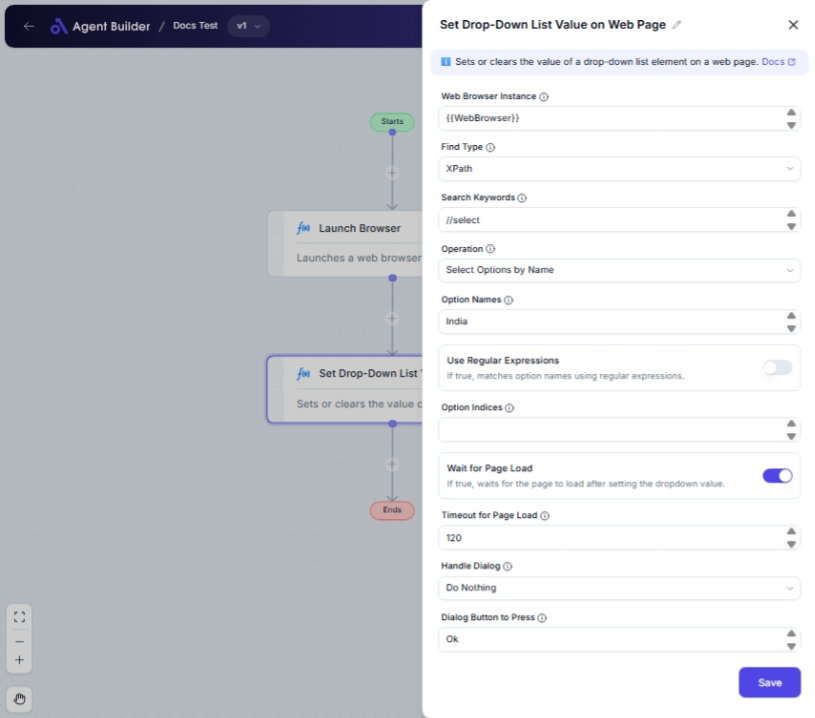

import { Callout, Steps } from "nextra/components";

# Set Drop-Down List Value on Web Page

The **Set Drop-Down List Value on Web Page** node allows you to automatically select a value from a drop-down list on a webpage. This can be useful for automating form submissions or data entry tasks where multiple options are available in a drop-down list.

For example:

- Selecting a country from a list of countries.
- Setting a state within a state drop-down menu during address input.
- Automating selections in forms based on external data.

{/*  */}

## Configuration Options

| Field Name                  | Description                                                                               | Input Type | Required? | Default Value       |
| --------------------------- | ----------------------------------------------------------------------------------------- | ---------- | --------- | ------------------- |
| **Web Browser Instance**    | Enter or choose the variable that contains the web browser instance to work with.         | Text       | Yes       | _(empty)_           |
| **Find Type**               | Specifies how to find the element (e.g., ID, XPath, CssSelector).                         | Select     | Yes       | XPath               |
| **Search Keywords**         | The value used to locate the drop-down list (e.g., 'country', '//select[@id='country']"). | Text       | Yes       | _(empty)_           |
| **Operation**               | Specifies whether to select by name, index, or clear selection.                           | Select     | Yes       | SelectOptionsByName |
| **Option Names**            | Comma-separated option names to select. Only first is used if not multi-select.           | Text       | No        | _(empty)_           |
| **Use Regular Expressions** | If true, matches option names using regular expressions.                                  | Switch     | No        | false               |
| **Option Indices**          | Comma-separated indices of options to select.                                             | Text       | No        | _(empty)_           |
| **Wait for Page Load**      | If true, waits for the page to load after setting the dropdown value.                     | Switch     | No        | true                |
| **Timeout for Page Load**   | Maximum time in seconds to wait for the page to load.                                     | Text       | No        | 60                  |
| **Handle Dialog**           | Specifies what to do if a dialog appears after setting the dropdown value.                | Select     | No        | DoNothing           |
| **Dialog Button to Press**  | The button to press if a dialog appears (e.g., 'Ok', 'Cancel').                           | Text       | No        | Ok                  |

## Expected Output Format

There is no direct output from this node as it interacts with the UI in a web browser. However, the action of setting a drop-down value is executed on the webpage.

## Step-by-Step Guide

<Steps>
### Step 1

Add the **Set Drop-Down List Value on Web Page** node to your automation flow.

### Step 2

In the **Web Browser Instance** field, enter or select the variable that holds your web browser session.

### Step 3

Select the method to find the element from the **Find Type** dropdown (e.g., XPath, Id).

### Step 4

Enter the **Search Keywords** that correspond to the element in the web page's HTML.

### Step 5

Choose an **Operation** based on how you wish to select options:

- **Clear All Options**: Deselects all options.
- **Select Options by Name**: Chooses options using their visible text.
- **Select Options by Index**: Chooses options using their position.

### Step 6

If applicable, fill in **Option Names** or **Option Indices** depending on your operation type.

### Step 7

Optionally, configure whether to **Use Regular Expressions** and if the node should **Wait for Page Load**.

### Step 8

Optionally, define how to handle any potential dialogs using **Handle Dialog** and specify a **Dialog Button to Press** if necessary.

</Steps>

<Callout type="warning" title="Important">
  Ensure that the web browser instance is active and that the element is present
  on the page before executing this node, or else it might fail.
</Callout>

## Input/Output Examples

### Scenario 1: Select by Name

- **Find Type**: XPath
- **Search Keywords**: `//select[@id='country']`
- **Operation**: Select Options by Name
- **Option Names**: `USA`
- **Output**: The "USA" option will be selected in the drop-down list on the web page.

### Scenario 2: Select by Index

- **Find Type**: XPath
- **Search Keywords**: `//select[@id='country']`
- **Operation**: Select Options by Index
- **Option Indices**: `0`
- **Output**: The first option in the drop-down list will be selected.

## Common Mistakes & Troubleshooting

| Problem                          | Solution                                                                                                                                              |
| -------------------------------- | ----------------------------------------------------------------------------------------------------------------------------------------------------- |
| **Element Not Found**            | Ensure the correct **Find Type** and **Search Keywords** are specified. Verify the browser instance is active and the element exists on the web page. |
| **Incorrect Selection**          | Double-check the **Option Names** or **Option Indices** fields and ensure they match the drop-down options exactly.                                   |
| **Dialog Appeared Unexpectedly** | Set the **Handle Dialog** option properly if pop-ups or dialogs are expected post-interaction.                                                        |

## Real-World Use Cases

- **Form Submission Automation**: Automatically select a user's country during online form submissions.
- **User Preference Settings**: Adjust preference settings for users in a web application interface.
- **Testing/Web Scraping**: Refreshing page content selection based on a drop-down choice in automated testing or data extraction tasks.
