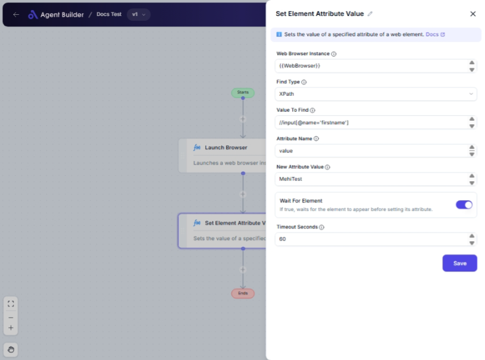

import { Callout, Steps } from "nextra/components";

# Set Element Attribute Value

The **Set Element Attribute Value** node allows you to dynamically change an attribute of an HTML element on a webpage. This is useful when automating web tasks, modifying web content, or customizing web interactions, such as changing input values or element styles without manually editing the source code.

## Configuration Options

| Field Name               | Description                                                                       | Input Type | Required? | Default Value |
| ------------------------ | --------------------------------------------------------------------------------- | ---------- | --------- | ------------- |
| **Web Browser Instance** | Enter or choose the variable that contains the web browser instance to work with. | Text       | Yes       | _(empty)_     |
| **Find Type**            | Specifies how to find the element (e.g., ID, XPath, CssSelector).                 | Select     | Yes       | XPath         |
| **Value To Find**        | The value used to locate the element (e.g., 'username', '//input[@id='email']').  | Text       | Yes       | _(empty)_     |
| **Attribute Name**       | The name of the attribute to set (e.g., 'value', 'class', 'style').               | Text       | Yes       | _(empty)_     |
| **New Attribute Value**  | The new value to assign to the attribute.                                         | Text       | Yes       | _(empty)_     |
| **Wait For Element**     | If true, waits for the element to appear before setting its attribute.            | Switch     | No        | Off           |
| **Timeout Seconds**      | Maximum time in seconds to wait for the element before failing.                   | Text       | No        | 60            |

## Expected Output Format

The output of this node doesn't produce a visible result in the data flow but modifies the targeted web element's attribute on the webpage as per the configuration.

## Step-by-Step Guide

<Steps>
### Step 1

Add a **Set Element Attribute Value** node into your flow.

### Step 2

In the **Web Browser Instance** field, enter the variable that holds your web browser instance.

### Step 3

Select a method in the **Find Type** dropdown to define how to locate the target element on the page.

### Step 4

Enter the specific locator value in **Value To Find** to identify the element (e.g., 'username', '//input[@id='email']').

### Step 5

Specify the **Attribute Name** that you wish to change (e.g., 'value', 'style').

### Step 6

Enter the **New Attribute Value** to assign to this attribute.

### Step 7

(Optional) If requiring the page to load elements first, toggle **Wait For Element** to 'On' and set **Timeout Seconds** for allowance.

</Steps>

<Callout type="info" title="Note">
  "Wait For Element" is useful on dynamic web pages where elements may take time
  to load.
</Callout>

## Input/Output Examples

- **Example:** To change a textbox value:

  - Find Type: XPath
  - Value To Find: `//input[@id='username']`
  - Attribute Name: `value`
  - New Attribute Value: `newUser123`

  Output: The 'username' field on the webpage now contains the value `newUser123`.

## Common Mistakes & Troubleshooting

| Problem                   | Solution                                                                                               |
| ------------------------- | ------------------------------------------------------------------------------------------------------ |
| **Element not found**     | Ensure the Find Type and Value To Find are correctly configured to target the element.                 |
| **Attribute not changed** | Verify the Attribute Name matches exactly with the name on the HTML element.                           |
| **Timeout error**         | Increase **Timeout Seconds** to allow more time for the element to load if **Wait For Element** is on. |

## Real-World Use Cases

- **Login Automation**: Quickly fill and submit web forms by setting values on input elements dynamically.
- **Web Testing Automation**: Modify webpage attributes as part of automated tests to simulate different user interactions.
- **User Interface Customization**: Change styles or attributes to show different versions of a webpage for A/B testing.
