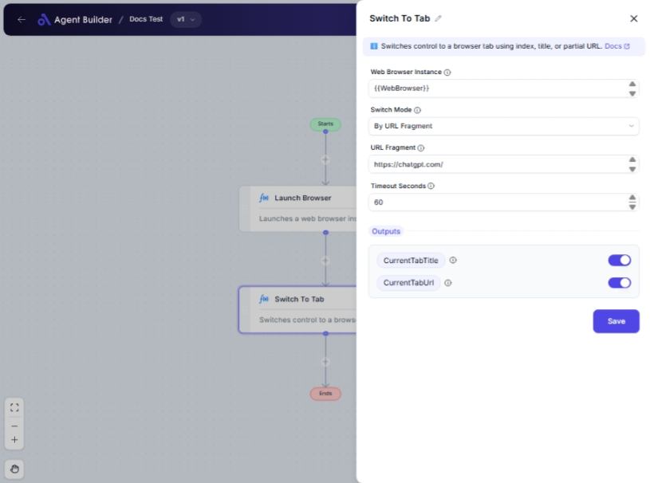

import { Callout, Steps } from "nextra/components";

# Switch To Tab

The **Switch To Tab** node enables you to navigate between open tabs in a web browser. By providing specific criteria, such as the tab's index, title, or a fragment of its URL, you can efficiently switch to the desired tab during automation processes.

This functionality is particularly useful in tasks that require automation across multiple websites, allowing you to control the focus on various tabs without manual intervention.

{/*  */}

## Configuration Options

| Field Name               | Description                                                                       | Input Type | Required? | Default Value |
| ------------------------ | --------------------------------------------------------------------------------- | ---------- | --------- | ------------- |
| **Web Browser Instance** | Enter or choose the variable that contains the web browser instance to work with. | Text       | Yes       | _(empty)_     |
| **Switch Mode**          | Specifies how to locate the tab: by index, title, or URL fragment.                | Select     | Yes       | ByIndex       |
| **Tab Index**            | The index (1-based) of the tab to switch to.                                      | Text       | No        | _(empty)_     |
| **Tab Title**            | The title of the tab to switch to.                                                | Text       | No        | _(empty)_     |
| **URL Fragment**         | A partial URL (e.g., 'example.com') to match the tab.                             | Text       | No        | _(empty)_     |
| **Timeout Seconds**      | Maximum time in seconds to wait for the tab to become available.                  | Text       | No        | 60            |

## Expected Output Format

The output of this node provides information about the currently active tab after the switch:

- **Current Tab Title**: A text string representing the title of the active tab.
- **Current Tab URL**: A text string containing the URL of the active tab.

## Step-by-Step Guide

<Steps>

### Step 1

Add **Switch To Tab** node into your flow.

### Step 2

In the **Web Browser Instance** field, input the variable representing the existing web browser you wish to work with.

### Step 3

Select the **Switch Mode** from the dropdown to specify how the tab will be identified:

- **By Index**: Switches by its order.
- **By Title**: Uses the tab's text title.
- **By URL Fragment**: Matches part of the tab's URL.

### Step 4

Enter additional details based on the **Switch Mode** chosen:

- For **By Index**, specify the **Tab Index**.
- For **By Title**, enter the full or partial **Tab Title**.
- For **By URL Fragment**, input the relevant **URL Fragment**.

### Step 5

(Optional) Set the **Timeout Seconds** to define the wait time for the tab to become active.

### Step 6

After configuration, the active tab's title and URL are available as **CurrentTabTitle** and **CurrentTabUrl** outputs, respectively.

</Steps>

<Callout type="info" title="Important Note">
  Ensure that the web browser instance used is active and contains several open
  tabs. Otherwise, the switching process may fail.
</Callout>

## Input/Output Examples

| Switch Mode     | Input Value   | Tab Index | Tab Title | URL Fragment     | Timeout Seconds | Output Value           | Output Type            |
| --------------- | ------------- | --------- | --------- | ---------------- | --------------- | ---------------------- | ---------------------- |
| By Index        | 1             | 3         | _(n/a)_   | _(n/a)_          | 60              | Example Tab 3          | Current Tab Title, URL |
| By Title        | Title here    | _(n/a)_   | Doc Tab   | _(n/a)_          | 60              | Document Page, Tab URL | Current Tab Title, URL |
| By URL Fragment | url fragments | _(n/a)_   | _(n/a)_   | fragment-example | 60              | Fragment Tab, Tab URL  | Current Tab Title, URL |

## Common Mistakes & Troubleshooting

| Problem                           | Solution                                                                                   |
| --------------------------------- | ------------------------------------------------------------------------------------------ |
| **Tab not switching as expected** | Check if the correct **Switch Mode** is chosen and field inputs correspond to opened tabs. |
| **Timeout Occurs**                | Increase the **Timeout Seconds** if the tab takes longer to become available.              |
| **Incorrect Tab URL**             | Verify that the **URL Fragment** accurately matches part of the desired tab's URL.         |

## Real-World Use Cases

- **Multi-tab Browsing Sessions**: Automate process of switching between various web pages in research.
- **Data Scraping Tasks**: Focus the active tab during data extraction processes from different sites.
- **Testing Web Applications**: Seamlessly navigate between browser tabs while running automated test scripts.
