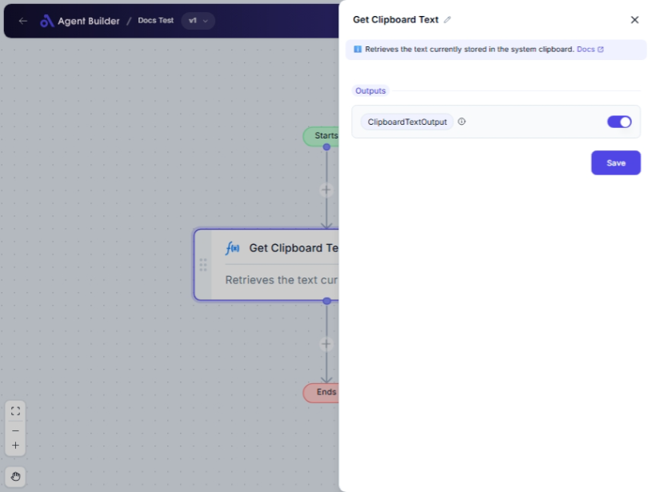

import { Callout, Steps } from "nextra/components";

# Get Clipboard Text

The **Get Clipboard Text** node allows you to access and use the text currently stored on the clipboard of your computer. This is helpful when you need to automate tasks that involve copying text data between different applications or documents. You might use this node when you need to reuse text you've copied without manually pasting it each time.

For example:

- Copying and using text from a document or webpage.
- Automating form-filling processes by using pre-copied text.
- Collecting and processing repeated data entries without manual pasting.

## Configuration Options

There are no fields to configure for this node, as it automatically retrieves and outputs the text stored on the clipboard.

## Expected Output Format

The output of this node is a **string of text** retrieved from the clipboard.

- If the clipboard contains text, that exact text is outputted (e.g., `"Hello, World!"`).
- If the clipboard is empty or contains non-text data, the output will be empty or may require verification that it is text-capable.

## Step-by-Step Guide

<Steps>
### Step 1

Add the **Get Clipboard Text** node into your process flow.

### Step 2

Ensure that the text you want to use is currently copied onto your clipboard. You can do this by manually copying the desired text or setting it up in a prior automation step.

### Step 3

The text from the clipboard is automatically pulled into your workflow and available as **ClipboardTextOutput** for further processing or use within other nodes.

</Steps>

<Callout type="info" title="Tip">
  Make sure the clipboard is text-enabled before using this node, as non-text
  items may cause unexpected results.
</Callout>

## Input/Output Examples

| Clipboard Content    | Output Value         | Output Type |
| -------------------- | -------------------- | ----------- |
| "Hello, World!"      | "Hello, World!"      | Text        |
| (Empty Clipboard)    | ""                   | Text        |
| Clipboard with Image | _Requires text only_ | _n/a_       |

## Common Mistakes & Troubleshooting

| Problem                              | Solution                                                                                                |
| ------------------------------------ | ------------------------------------------------------------------------------------------------------- |
| **Clipboard is empty**               | Ensure text data is copied onto the clipboard before running this node.                                 |
| **Clipboard contains non-text data** | Verify that your clipboard data is text. Consider using manual copy or a preparatory node to format it. |
| **Unexpected output occurs**         | Check that no other applications are modifying the clipboard content during the automation run.         |

## Real-World Use Cases

- **Data Transfer**: Quickly transfer text content from a scanned document into a digital form without manual entry.
- **Automation Scripts**: Use text automation scripts in repetitive tasks that depend on clipboard data.
- **Content Management**: Capture and reuse text snippets from research or marketing materials efficiently.
