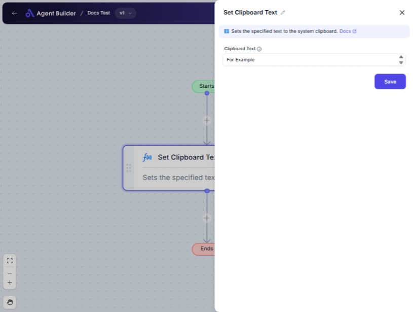

import { Callout, Steps } from "nextra/components";

# Set Clipboard Text

The **Set Clipboard Text** node allows you to set a specific text value onto your system's clipboard. This is useful for scenarios where you need to automate the process of copying text, such as preparing content to be pasted into emails, documents, or other applications with just a simple action.

For example:

- Preparing a specific piece of text to be pasted into customer emails.
- Automating the copying of user data for reports or forms.
- Setting frequently used responses or data snippets for quick access.

## Configuration Options

| Field Name         | Description                             | Input Type | Required? | Default Value |
| ------------------ | --------------------------------------- | ---------- | --------- | ------------- |
| **Clipboard Text** | The text you want to copy to clipboard. | Text       | No        | _(empty)_     |

## Expected Output Format

This node does not produce an output in terms of data flow. The action outcome is the text being available in the clipboard, ready for pasting elsewhere in plain text format.

## Step-by-Step Guide

<Steps>
### Step 1

Add **Set Clipboard Text** node into your flow.

### Step 2

In the **Clipboard Text** field, enter the text you desire to copy onto the clipboard.

### Step 3

Once the node runs, the specified text is automatically copied to your system's clipboard.

</Steps>

<Callout type="info" title="Note">
  Ensure that the **Clipboard Text** field contains only the text you wish to
  copy. This node does not validate text content for errors.
</Callout>

## Common Mistakes & Troubleshooting

| Problem                                 | Solution                                                                                                    |
| --------------------------------------- | ----------------------------------------------------------------------------------------------------------- |
| **Text not copied to clipboard**        | Verify the node ran successfully and the clipboard permissions allow setting clipboard text on your system. |
| **Text appears incorrect in clipboard** | Double-check the **Clipboard Text** field. Ensure there's no unintended formatting or extra characters.     |

## Real-World Use Cases

- **Customer Service**: Quickly copy pre-drafted responses or disclaimers for customer communication.
- **Content Creation**: Easily load and reuse template snippets during document or article preparation.
- **Data Entry**: Automate data population processes by setting structured data on the clipboard.
- **Software Testing**: Copy test data or logs to clipboard for faster paste into bug reports or documentation.
