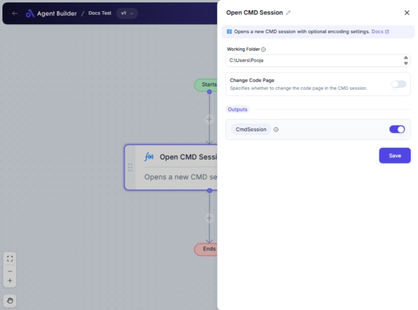

import { Callout, Steps } from "nextra/components";

# Open CMD Session

The **Open CMD Session** node allows you to programmatically open a Command Prompt (CMD) session from within your automation flow. This is useful when you need to execute command-line tasks, scripts, or applications as part of your workflow.

For example, you might initiate a CMD session to run batch scripts, manage system configurations, or interface with software that requires command-line interaction.

## Configuration Options

| Field Name           | Description                                                                                 | Input Type | Required? | Default Value |
| -------------------- | ------------------------------------------------------------------------------------------- | ---------- | --------- | ------------- |
| **Working Folder**   | The directory where the CMD session should start. Input the folder path (e.g., `C:\Users`). | Text       | Yes       | _(empty)_     |
| **Change Code Page** | Toggle to specify whether to change the code page.                                          | Switch     | No        | False         |
| **Encoding**         | The encoding format for the CMD session if 'Change Code Page' is enabled.                   | Select     | No        | UTF8          |

## Expected Output Format

The output after opening the CMD session will be **CMD Session** details. This typically includes session identifiers or status details but is primarily used to pass context to subsequent nodes in your flow.

## Step-by-Step Guide

<Steps>
### Step 1

Add an **Open CMD Session** node into your flow.

### Step 2

In the **Working Folder** field, input the directory path where you want the CMD session to start. This field is required to ensure the CMD starts in the correct folder (e.g., `C:\Users`).

### Step 3

Use the **Change Code Page** switch if you need to modify the encoding used within the CMD session. Turn it on if required.

### Step 4

If you enabled **Change Code Page**, select the desired **Encoding** from the dropdown. Options include `UTF8`, `UTF7`, `ASCII`, `Windows1252`, and more.

### Step 5

The CMD session will be opened, and its details are stored in **CmdSession** for further use in your automation workflow.

</Steps>

<Callout type="info" title="Tip">
  You only need to set the **Encoding** if you plan to change the code page. If
  you're not sure, leave the **Change Code Page** setting off.
</Callout>

## Input/Output Examples

| Working Folder | Change Code Page | Encoding | CMD Session Details |
| -------------- | ---------------- | -------- | ------------------- |
| `C:\Projects`  | False            | _(n/a)_  | CMD session context |
| `D:\Data`      | True             | UTF8     | CMD session context |

## Common Mistakes & Troubleshooting

| Problem                               | Solution                                                                                          |
| ------------------------------------- | ------------------------------------------------------------------------------------------------- |
| **CMD session not starting**          | Ensure the **Working Folder** path is correct and accessible. Check for typos or incorrect paths. |
| **Encoding not applied**              | Make sure **Change Code Page** is enabled; then select the desired **Encoding**.                  |
| **Unable to execute commands in CMD** | Verify that the CMD session is open and the working folder has correct permissions.               |

## Real-World Use Cases

- **Run Scheduled Scripts**: Start a CMD session to execute daily batch scripts for backups or data processing.
- **System Configuration**: Launch CMD to alter system settings or install software requiring command-line inputs.
- **Developer Workflows**: Automate the start of development environments or build processes requiring command execution.
