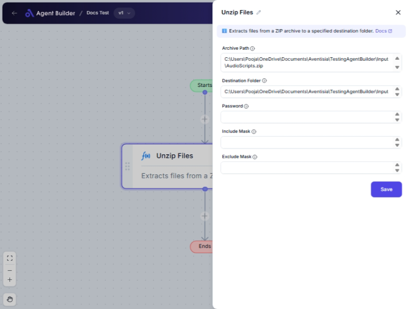

import { Callout, Steps } from "nextra/components";

# Unzip Files

The **Unzip Files** node allows you to extract the contents of a ZIP archive to a specified folder on your computer. This is handy when you receive compressed files and need to access or process their contents. With this node, you can select specific files to extract, overwrite existing files, or protect your archive with a password.

{/*  */}

## Configuration Options

| Field Name             | Description                                                                                                            | Input Type | Required? | Default Value |
| ---------------------- | ---------------------------------------------------------------------------------------------------------------------- | ---------- | --------- | ------------- |
| **Archive Path**       | The full path of the ZIP file to extract.                                                                              | Text       | Yes       | _(empty)_     |
| **Destination Folder** | The full path of the folder to extract the archive to. Existing files in this directory may be overwritten.            | Text       | Yes       | _(empty)_     |
| **Password**           | The password used for this archive, if any.                                                                            | Text       | No        | _(empty)_     |
| **Include Mask**       | Limits the extracted files to those matching the mask. Use wildcards like '\*.txt'. Multiple filters separated by ';'. | Text       | No        | _(empty)_     |
| **Exclude Mask**       | Excludes files matching the mask. Use wildcards like '\*.log'. Multiple filters separated by ';'.                      | Text       | No        | _(empty)_     |

## Expected Output Format

The output of this node is a collection of extracted files in the specified destination folder. It will not create a text or numeric output but rather files in their original formats.

## Step-by-Step Guide

<Steps>
### Step 1

Add **Unzip Files** node into your flow.

### Step 2

In the **Archive Path** field, enter the full path to the ZIP file you wish to extract.

### Step 3

In the **Destination Folder** field, provide the full path where you want the contents to be extracted.

### Step 4

If required, enter the **Password** for the archive to enable extraction.

### Step 5

Use **Include Mask** if you need to extract only specific file types (e.g., '\*.txt').

### Step 6

Use **Exclude Mask** if you want to exclude specific file types from extraction (e.g., '\*.log').

### Step 7

Once configured, run the node to extract the files to your chosen destination.

</Steps>

<Callout type="info" title="Tip">
  Use the **Include Mask** and **Exclude Mask** fields to filter files
  effectively when dealing with large archives.
</Callout>

## Input/Output Examples

| Archive Path           | Destination Folder | Password | Include Mask | Exclude Mask | Files Extracted                     |
| ---------------------- | ------------------ | -------- | ------------ | ------------ | ----------------------------------- |
| `/path/to/archive.zip` | `/extracted/files` | `(none)` | `*.txt;*.md` | `*.log`      | Files like `readme.txt`, `notes.md` |

## Common Mistakes & Troubleshooting

| Problem                             | Solution                                                                                             |
| ----------------------------------- | ---------------------------------------------------------------------------------------------------- |
| **Incorrect Archive Path**          | Ensure the path to the ZIP file is correct and accessible.                                           |
| **Files not extracting**            | Check if the ZIP file is password-protected and ensure the correct password is entered.              |
| **Unexpected files extracted**      | Verify the **Include Mask** and **Exclude Mask** settings to ensure correct filtering.               |
| **Destination folder not writable** | Confirm that the specified destination folder is writable and that there's enough space on the disk. |

## Real-World Use Cases

- **Document Management**: Extract only required document files from a large ZIP archive containing mixed file formats.
- **Monthly Reports**: Automatically unzip and sort monthly CSV reports into designated folders for processing and review.
- **Backup Systems**: Unzip backup files while excluding unnecessary log files for efficiency.
