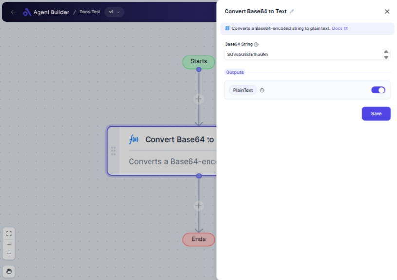

import { Callout, Steps } from "nextra/components";

# Convert Base64 to Text

The **Convert Base64 to Text** node transforms a Base64-encoded string back into readable text. This is particularly useful when dealing with data stored in Base64 formats, such as emails or file encodings, which need to be displayed as ordinary text for further processing or analysis.

Some common scenarios for using this node include decoding Base64 data from web APIs, accessing text data from encoded files, or processing email body content that is Base64-encoded.

{/*  */}

## Configuration Options

| Field Name        | Description                           | Input Type | Required? | Default Value |
| ----------------- | ------------------------------------- | ---------- | --------- | ------------- |
| **Base64 String** | The Base64-encoded string to convert. | Text       | Yes       | _(empty)_     |

## Expected Output Format

The output of this node is the **Plain Text**:

- The node decodes the Base64 string and returns a **plain text value** as output.

## Step-by-Step Guide

<Steps>
### Step 1

Add the **Convert Base64 to Text** node into your flow.

### Step 2

In the **Base64 String** field, enter the Base64-encoded text you wish to convert into plain text.

### Step 3

The node will automatically process the input and make the decoded plain text available as **PlainText** for use in subsequent nodes.

</Steps>

<Callout type="info" title="Tip">
  Ensure your Base64 string is properly formatted before inputting. Invalid
  Base64 strings will not be converted correctly.
</Callout>

## Input/Output Examples

| Input Base64 String          | Output Plain Text   | Output Type |
| ---------------------------- | ------------------- | ----------- |
| SGVsbG8gd29ybGQh             | Hello world!        | Plain Text  |
| RGVjb2RlIHRoaXMgYmFzZTY0Lg== | Decode this Base64. | Plain Text  |

## Common Mistakes & Troubleshooting

| Problem                            | Solution                                                                                                     |
| ---------------------------------- | ------------------------------------------------------------------------------------------------------------ |
| **Incorrect Base64 string format** | Check that your Base64 string is correctly formatted with proper padding (using `=`) if needed.              |
| **No text output**                 | Ensure the input Base64 string is not empty and is valid. Check for accidental text input that isn’t Base64. |

## Real-World Use Cases

- **Email Processing**: Decode email body content encoded in Base64 to preserve text integrity for display.
- **Web Data Handling**: Decode Base64 web API responses to access underlying text data directly.
- **Data Archiving**: Convert file strings to text for easy viewing or cataloging in data storage systems.
