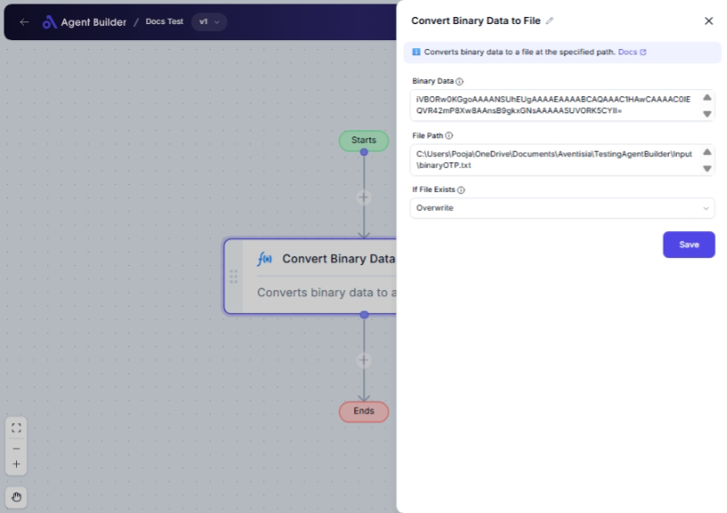

import { Callout, Steps } from "nextra/components";

# Convert Binary Data to File

The **Convert Binary Data to File** node helps you transform binary data into a physical file on your system. This is particularly useful when you need to save or store data that comes in binary format, such as files received through network communication or other integrations.

For example:

- Storing images, documents, or other files received as binary data.
- Creating backups from binary streams.
- Saving decoded data from APIs or services.

## Configuration Options

| Field Name         | Description                                                                                      | Input Type | Required? | Default Value |
| ------------------ | ------------------------------------------------------------------------------------------------ | ---------- | --------- | ------------- |
| **Binary Data**    | The binary data you want to convert and save as a file.                                          | Text       | Yes       | _(empty)_     |
| **File Path**      | The complete path on your computer where you want the file to be saved.                          | Text       | Yes       | _(empty)_     |
| **If File Exists** | Decide what should happen if a file with the same name already exists at the specified location. | Select     | Yes       | DoNothing     |

## Expected Output Format

The output of this node is the creation of a **physical file** at the indicated path. There is no direct on-screen output, but the action results in a file being saved on the specified location on your computer.

- The file will be in the format encoded from the binary input.
- If you choose "Overwrite", existing files are deleted and replaced with the new file.

## Step-by-Step Guide

<Steps>
### Step 1

Add the **Convert Binary Data to File** node into your flow.

### Step 2

In the **Binary Data** field, input the binary data you want to convert into a file.

### Step 3

In the **File Path** field, specify the full path including the filename and extension where you want the file to be saved.

### Step 4

In the **If File Exists** dropdown, select your preferred action if a file with the same name exists:

- **Do nothing**: The node will skip creating a new file if one exists.
- **Overwrite**: The existing file will be removed, and a new file will be created.

### Step 5

Execute the process and check the specified path to verify the file creation.

</Steps>

<Callout type="warning" title="Warning">
  Be careful when choosing "Overwrite" in the **If File Exists** dropdown, as
  this will delete the existing file in the target location.
</Callout>

## Input/Output Examples

| Binary Data | File Path             | If File Exists | Resulting Action                                |
| ----------- | --------------------- | -------------- | ----------------------------------------------- |
| 011010...   | /path/to/document.txt | Do nothing     | No file created if document.txt already exists. |
| 101110...   | /path/to/image.png    | Overwrite      | Existing image.png is replaced with new file.   |

## Common Mistakes & Troubleshooting

| Problem                    | Solution                                                                                                       |
| -------------------------- | -------------------------------------------------------------------------------------------------------------- |
| **File Path is incorrect** | Ensure the file path you have entered is complete and includes both the directory and filename with extension. |
| **Binary Data not valid**  | Ensure the data is a valid binary sequence and represents the file format you're intending to save.            |
| **Permission Denied**      | Check that you have the necessary file system permissions to write to the target directory.                    |

## Real-World Use Cases

- **Automated Report Generation**: Convert and save reports received in binary format as PDF files.
- **Image Processing**: Store incoming image streams as files for later editing or viewing.
- **Data Backup**: Automatically create file backups from binary data produced by other systems.
