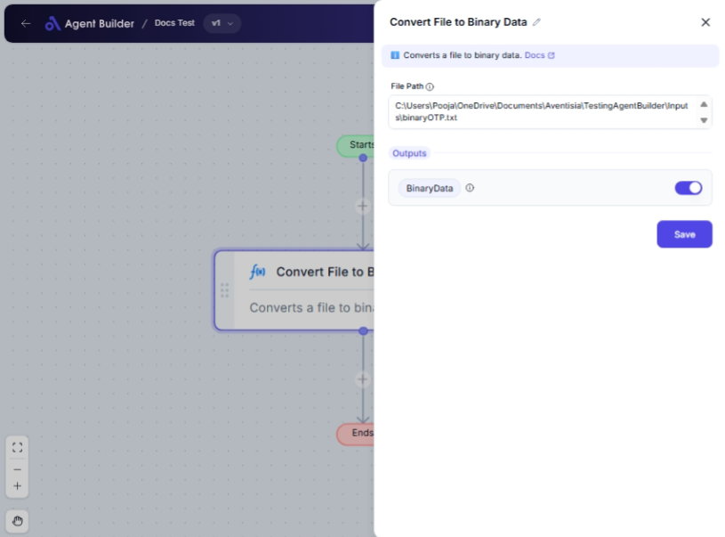

import { Callout, Steps } from "nextra/components";

# Convert File to Binary Data

The **Convert File to Binary Data** node is a tool you use when you need to transform a file into its binary data representation. This is particularly useful when you're preparing file data for processing, storage, or transmission in systems that require non-textual data formats.

For example, if you have a file stored locally on your computer and you wish to send its contents to a server or embed it within another system, converting it to binary data is essential to ensure all the bits are correctly interpreted.

{/*  */}

## Configuration Options

| Field Name    | Description                           | Input Type | Required? | Default Value |
| ------------- | ------------------------------------- | ---------- | --------- | ------------- |
| **File Path** | The full path of the file to convert. | Text       | Yes       | _(empty)_     |

## Expected Output Format

The output is the **binary data** representation of the file as a raw binary sequence. This binary data can then be used as needed in subsequent nodes or systems.

## Step-by-Step Guide

<Steps>
### Step 1

Add **Convert File to Binary Data** node into your flow.

### Step 2

In the **File Path** field, enter the full directory path to the file you wish to convert. This path should point directly to the file on your computer.

### Step 3

Once the file path is configured, the node will output the file's binary data. This is available as **BinaryData** for use in the following parts of your automation workflow.

</Steps>

<Callout type="warning" title="Note">
  Ensure that the file path you provide is correct and that the file is
  accessible from your system. Incorrect paths will lead to errors.
</Callout>

## Input/Output Examples

| File Path                   | Output Value                           | Output Type |
| --------------------------- | -------------------------------------- | ----------- |
| `/users/documents/file.txt` | Binary data representation of file.txt | Binary Data |

## Common Mistakes & Troubleshooting

| Problem                                     | Solution                                                                                                  |
| ------------------------------------------- | --------------------------------------------------------------------------------------------------------- |
| **File not found at specified path**        | Double-check the **File Path** to ensure it's correct and that the file exists at the specified location. |
| **Insufficient permissions to access file** | Verify that you have the necessary permissions to access the file. Adjust permissions if needed.          |

## Real-World Use Cases

- **Embedding Files**: Convert images to binary data for embedding directly within databases or HTML.
- **Data Backup Systems**: Automate the conversion of files to binary for efficient backup processes.
- **File Transfer Protocols**: Transform files into binary data for secure and correct transmission over network protocols.
