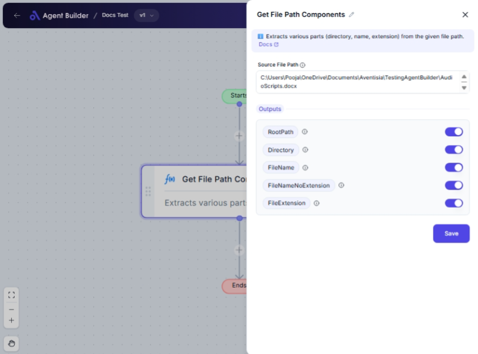

import { Callout, Steps } from "nextra/components";

# Get File Path Components

The **Get File Path Components** node helps you to break down a full file path into its constituent elements. You can extract the root path, directory, file name, file name without extension, and file extension. This is especially useful for organizing files, processing paths, or when you need specific parts of a file path for further operations.

{/*  */}

## Configuration Options

| Field Name                      | Description                                                 | Input Type | Required? | Default Value       |
| ------------------------------- | ----------------------------------------------------------- | ---------- | --------- | ------------------- |
| **Source File Path**            | The full path of the file from which to extract components. | Text       | Yes       | _(empty)_           |
| **Root Path**                   | The root path of the source file.                           | Output     | No        | RootPath            |
| **Directory Path**              | The directory of the source file.                           | Output     | No        | Directory           |
| **File Name**                   | The name of the source file.                                | Output     | No        | FileName            |
| **File Name Without Extension** | The file name (without the extension) of the source file.   | Output     | No        | FileNameNoExtension |
| **File Extension**              | The extension (for example, .doc) of the source file.       | Output     | No        | FileExtension       |

## Expected Output Format

The output of this node consists of multiple text values representing each component of the file path:

- **Root Path**: Root part of the path (e.g., `C:\` on Windows).
- **Directory Path**: Path excluding file name (e.g., `C:\Users\Documents`).
- **File Name**: Full file name including extension (e.g., `report.docx`).
- **File Name Without Extension**: Name of the file without extension (e.g., `report`).
- **File Extension**: The file's extension (e.g., `.docx`).

## Step-by-Step Guide

<Steps>
### Step 1

Add **Get File Path Components** node into your flow.

### Step 2

In the **Source File Path** field, enter the full path of the file you want to break down.

### Step 3

Review the output fields that will now be populated based on your input:

- **Root Path**: Displays the root path.
- **Directory Path**: Displays the directory path.
- **File Name**: Displays the complete file name.
- **File Name Without Extension**: Displays the file name without its extension.
- **File Extension**: Displays the file's extension.

### Step 4

Use the extracted path components as needed in your automation flow.

</Steps>

<Callout type="info" title="Tip">
  Ensure the **Source File Path** is correctly formatted and exists in your
  system to avoid errors in output extraction.
</Callout>

## Input/Output Examples

| Source File Path                       | Root Path | Directory Path             | File Name     | File Name Without Extension | File Extension |
| -------------------------------------- | --------- | -------------------------- | ------------- | --------------------------- | -------------- |
| `C:\Users\Alice\Documents\report.docx` | `C:\`     | `C:\Users\Alice\Documents` | `report.docx` | `report`                    | `.docx`        |
| `/home/user/project/index.html`        | `/`       | `/home/user/project`       | `index.html`  | `index`                     | `.html`        |

## Common Mistakes & Troubleshooting

| Problem                                      | Solution                                                                                                               |
| -------------------------------------------- | ---------------------------------------------------------------------------------------------------------------------- |
| **File path is incorrect or does not exist** | Double-check the **Source File Path** for typos or incorrect formatting. Ensure the file path is valid on your system. |
| **Outputs are not populated correctly**      | Verify the **Source File Path** is accurate. Outputs are directly dependent on the validity of this input.             |

## Real-World Use Cases

- **File Management**: Automate organizing files by sorting them into directories based on their file extensions.
- **Data Backup**: Extract and utilize file path components for custom backup folder hierarchies.
- **Logging and Reporting**: Generate logs or reports where only specific parts of a file path are needed for clarity or reference.
