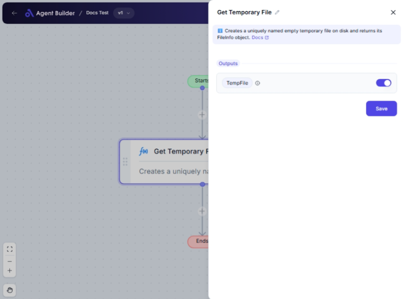

import { Callout, Steps } from "nextra/components";

# Get Temporary File

The **Get Temporary File** node is designed to create a temporary file on your computer. This is useful when you need a temporary place to store data or files during the execution of a workflow, without creating a permanent file on the disk. Think of it as a short-term storage solution that is automatically cleaned up when no longer needed.

Temporary files can be helpful for converting data types, holding intermediate data outputs, or managing file processing tasks in a seamless and efficient manner.

## Configuration Options

| Field Name         | Description                                                                            | Input Type | Required? | Default Value |
| ------------------ | -------------------------------------------------------------------------------------- | ---------- | --------- | ------------- |
| **Temporary File** | Gives you the file information object representing the temporary file created on disk. | Output     | No        | TempFile      |

## Expected Output Format

The output of this node is a **FileInfo object**. It contains information about the temporary file, such as its name, location, and size, which can be used in subsequent nodes for further processing.

## Step-by-Step Guide

<Steps>
### Step 1

Add **Get Temporary File** node into your flow.

### Step 2

There are no configurable options required for setting up this node. Upon activation, it auto-generates a temporary file.

### Step 3

Use the created temporary file information (`TempFile`) in other nodes within your workflow to store or pass data as needed.

### Step 4

Once the workflow execution is complete, the temporary file is automatically cleaned up, ensuring no clutter on your disk.

</Steps>

<Callout type="note" title="Note">
  Temporary files are meant for short-term use during workflow execution. They
  are deleted automatically after their purpose is served.
</Callout>

## Input/Output Examples

As this node creates a temporary file, there is no specific input required. The output will typically resemble a file information object as follows:

| Output Name | Output Type     | Description                             |
| ----------- | --------------- | --------------------------------------- |
| TempFile    | FileInfo object | Contains metadata of the temporary file |

## Common Mistakes & Troubleshooting

| Problem                             | Solution                                                                                                   |
| ----------------------------------- | ---------------------------------------------------------------------------------------------------------- |
| **Cannot find the temporary file**  | Ensure that the workflow is running. The temporary file exists only during the execution of the workflow.  |
| **File not deleted post execution** | Check for errors in workflow completion. The cleanup occurs automatically after a successful workflow run. |

## Real-World Use Cases

- **Data Processing Pipelines**: Temporarily store data output from one node before processing in the next node.
- **Intermediate Calculations**: Hold calculation results that don’t need to be kept permanently.
- **File Conversions**: Convert file types in a transient manner, ensuring minimal resource usage.
