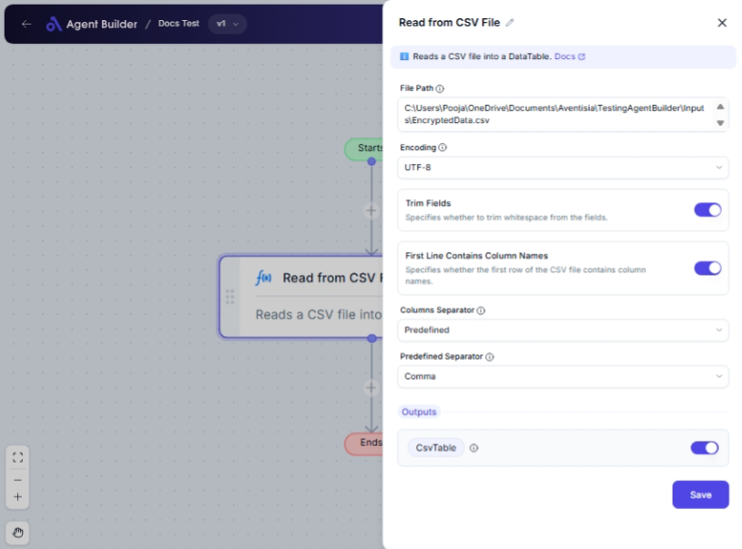

import { Callout, Steps } from "nextra/components";

# Read from CSV File

The **Read from CSV File** node is designed to help you import data from a CSV (Comma-Separated Values) file into your automated process. This is useful when you need to process or analyze data stored in spreadsheets or exported from different systems.

It lets you specify which file to read, choose how to separate the data columns, and configure reading options such as encoding and trimming whitespace. This node is perfect for tasks such as data migration, reporting, or data cleansing.

{/*  */}

## Configuration Options

| Field Name                           | Description                                                            | Input Type | Required? | Default Value |
| ------------------------------------ | ---------------------------------------------------------------------- | ---------- | --------- | ------------- |
| **File Path**                        | The full path of the CSV file to read.                                 | Text       | Yes       | _(empty)_     |
| **Encoding**                         | The encoding of the CSV file.                                          | Select     | No        | UTF8          |
| **Trim Fields**                      | Specifies whether to trim whitespace from the fields.                  | Switch     | No        | Enabled       |
| **First Line Contains Column Names** | Specifies whether the first row of the CSV file contains column names. | Switch     | No        | Enabled       |
| **Columns Separator**                | The type of separator used in the CSV file (Predefined or Custom).     | Select     | No        | Predefined    |
| **Predefined Separator**             | The predefined delimiter used in the CSV file (e.g., Comma, Tab).      | Select     | No        | Comma         |
| **Custom Separator**                 | The custom delimiter used in the CSV file.                             | Text       | No        | _(empty)_     |

## Expected Output Format

The output of this node is a **DataTable** containing the content of the CSV file. Each row in the CSV file becomes a row in the DataTable, and each CSV column corresponds to a DataTable column.

- **Output Value**: CsvTable

## Step-by-Step Guide

<Steps>
### Step 1

Add the **Read from CSV File** node into your flow.

### Step 2

In the **File Path** field, enter the full path of the CSV file you wish to read.

### Step 3

Select the **Encoding** option suited to your file's format. If unsure, the default **UTF-8** usually works.

### Step 4

Decide whether to enable **Trim Fields**. This will remove any extra spaces from your data.

### Step 5

Choose whether the **First Line Contains Column Names**. This affects how the DataTable is formatted.

### Step 6

In the **Columns Separator** dropdown, select **Predefined** or **Custom** to specify how your columns are separated:

- If **Predefined**, choose from common separators like **Comma**, **Tab**, or **Semicolon**.
- If **Custom**, enter your own custom separator character in the **Custom Separator** field that appears.

### Step 7

Once configured, the CSV will be read into a DataTable named **CsvTable** for subsequent use in your workflow.

</Steps>

<Callout type="info" title="Tip">
  Use the **Custom Separator** option if you're dealing with unusual or specific
  delimiters not covered by the predefined choices.
</Callout>

## Input/Output Examples

| Separator Type | Predefined Separator | Custom Separator | Output Table                       | Output Type                     |
| -------------- | -------------------- | ---------------- | ---------------------------------- | ------------------------------- | --- | --------- |
| Predefined     | Comma                | _(n/a)_          | Rows and columns from the CSV file | DataTable                       |
| Predefined     | Tab                  | _(n/a)_          | Rows and columns separated by tabs | DataTable                       |
| Custom         | _(n/a)_              | `                | `                                  | Rows and columns separated by ` | `   | DataTable |

## Common Mistakes & Troubleshooting

| Problem                                     | Solution                                                                                                |
| ------------------------------------------- | ------------------------------------------------------------------------------------------------------- |
| **File cannot be found**                    | Double-check the file path for accuracy or ensure the file exists at the specified location.            |
| **Incorrect column separation**             | Adjust the **Columns Separator** settings to the correct type (Predefined or Custom as needed).         |
| **Data appears with unexpected whitespace** | Make sure **Trim Fields** is enabled to remove these excess whitespaces.                                |
| **First row data appears as column names**  | Ensure **First Line Contains Column Names** is enabled only if your first row truly holds column names. |

## Real-World Use Cases

- **Data Import**: Quickly import spreadsheet data into your system for processing.
- **Generating Reports**: Automatically read and summarize CSV data for business reports.
- **Data Conversion**: Read data from CSV to prepare it for entry into a database.
- **Analysis Preparation**: Load CSV data for detailed analysis by data scientists or analysts.
