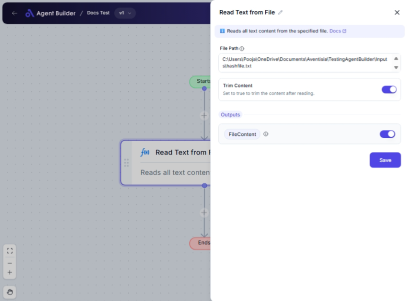

import { Callout, Steps } from "nextra/components";

# Read Text from File

The **Read Text from File** node is designed to access and retrieve text content from a specified file. You might use this node when you need to process or analyze the content of a text file without manually opening it. It's particularly useful in automation workflows where text data extraction from files is necessary for further processing or decision-making.

## Configuration Options

| Field Name       | Description                                    | Input Type | Required? | Default Value |
| ---------------- | ---------------------------------------------- | ---------- | --------- | ------------- |
| **File Path**    | The full path of the file to read.             | Text       | Yes       | _(empty)_     |
| **Trim Content** | Set to true to trim the content after reading. | Switch     | No        | true          |

## Expected Output Format

The output of this node is the **text content** retrieved from the file specified in the file path. The text content can be plain text or formatted text, depending on the file content.

## Step-by-Step Guide

<Steps>
### Step 1

Add the **Read Text from File** node into your flow.

### Step 2

In the **File Path** field, enter the full file path to the text file you wish to read.

### Step 3

If you want the content to be trimmed (removing leading and trailing spaces), ensure the **Trim Content** switch is turned on. It's switched on by default.

### Step 4

Once configured and executed, the node will output the text content as **FileContent** for use in other nodes.

</Steps>

<Callout type="info" title="Tip">
  Ensure the file path is correct and accessible before executing the node,
  otherwise, it may result in an error.
</Callout>

## Input/Output Examples

- **File Path**: `C:\Users\Documents\example.txt`
- **Trim Content**: Switched on
- **Output**: The content of `example.txt`, trimmed of any leading or trailing whitespace.

## Common Mistakes & Troubleshooting

| Problem                               | Solution                                                                                |
| ------------------------------------- | --------------------------------------------------------------------------------------- |
| **Invalid File Path**                 | Ensure that the file path is correct and that the file exists at that location.         |
| **Empty Output**                      | Check if the file is not empty and confirm that the file path is correct.               |
| **Unexpected Output with Whitespace** | Ensure "Trim Content" is switched on to remove unwanted leading or trailing whitespace. |

## Real-World Use Cases

- **Data Analysis**: Automatically read configuration files or logs to process data further.
- **Content Management**: Extract text content from files for use in content management systems.
- **Automated Reports**: Gather data from text files for inclusion in reports or dashboards.
- **File Monitoring**: Examine logs or other changing files and trigger actions based on content.
