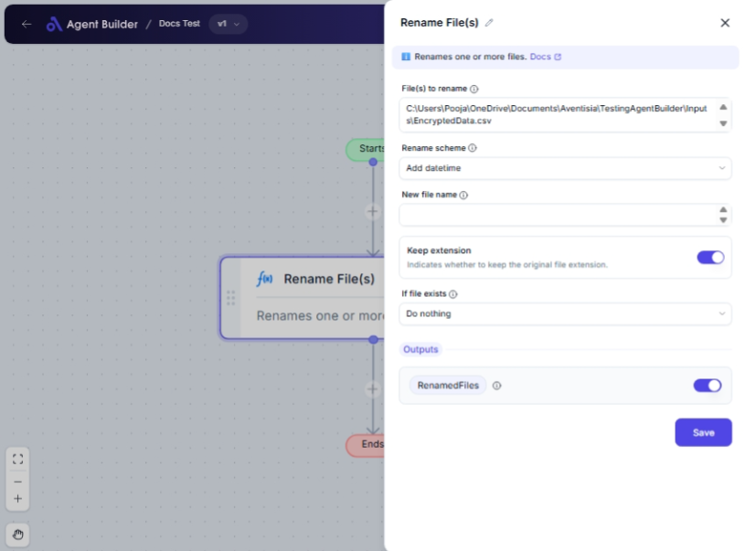

import { Callout, Steps } from "nextra/components";

# Rename File(s)

The **Rename File(s)** node allows you to modify the names of one or more files according to specified criteria. This is particularly useful if you need to organize files, ensure consistent naming conventions, or add identifying information like dates to file names.

For instance:

- Changing file names to match a new naming scheme across a directory.
- Appending timestamps to differentiate multiple versions of a document.
- Replacing or removing parts of existing file names for uniformity.

## Configuration Options

| Field Name            | Description                                                                            | Input Type | Required? | Default Value |
| --------------------- | -------------------------------------------------------------------------------------- | ---------- | --------- | ------------- |
| **File(s) to rename** | The path(s) of the file(s) to rename. Supports wildcards like `*.txt`.                 | Text       | Yes       | _(empty)_     |
| **Rename scheme**     | Specifies how you want to rename the file(s).                                          | Select     | Yes       | SetNewName    |
| **New file name**     | The new name for the file(s). Required for certain rename schemes like "Set new name". | Text       | No        | _(empty)_     |
| **Keep extension**    | Indicates whether the original file extension should be retained.                      | Switch     | Yes       | _(empty)_     |
| **If file exists**    | Defines what to do if a file with the new name already exists in the destination.      | Select     | Yes       | DoNothing     |

## Expected Output Format

This node produces a **list of renamed files** as its output:

- The output will be an array containing the paths of all successfully renamed files (e.g., `['C:/Documents/renamed-file.txt', 'D:/Images/renamed-image.png']`).

## Step-by-Step Guide

<Steps>
### Step 1

**Add** the **Rename File(s)** node to your workflow.

### Step 2

In the **File(s) to rename** field, input the path(s) of the file(s) you wish to rename. Use wildcards (e.g., `*.txt`) if applicable.

### Step 3

Use the **Rename scheme** dropdown to select how you want to modify the file names. Options include setting a new name, adding text, removing text, changing extensions, etc.

### Step 4

If you choose a specific scheme like "Set new name", enter the required details in the **New file name** field.

### Step 5

Decide whether to keep the original file extension by toggling the **Keep extension** switch.

### Step 6

In the **If file exists** dropdown, choose the action to perform if a file with the new name already exists: do nothing or overwrite.

### Step 7

Once configured, the node will process the files and generate an output with the updated file names, available as **RenamedFiles**.

</Steps>

<Callout type="info" title="Tip">
  Make sure the file paths are correct and accessible. Wildcards can be
  practical for batch operations but ensure they match the target files
  accurately.
</Callout>

## Input/Output Examples

| Rename Scheme    | Input Path      | New File Name    | Keep Extension | If Exists Action | Output                                  |
| ---------------- | --------------- | ---------------- | -------------- | ---------------- | --------------------------------------- |
| Set New Name     | `C:/Docs/*.txt` | `myfile_renamed` | Yes            | DoNothing        | `['C:/Docs/myfile_renamed.txt']`        |
| Change Extension | `C:/Docs/file`  | _(n/a)_          | No             | Overwrite        | `['C:/Docs/file.png']`                  |
| Add Datetime     | `D:/Logs/*.log` | _(n/a)_          | Yes            | DoNothing        | `['D:/Logs/logfile_20231009.log', ...]` |

## Common Mistakes & Troubleshooting

| Problem                          | Solution                                                                                            |
| -------------------------------- | --------------------------------------------------------------------------------------------------- |
| **Paths not recognized**         | Ensure that the path inputs are correct. Verify permissions and the existence of the files.         |
| **Files not renamed or skipped** | Check that your chosen actions and schemes match the intended files. Verify wildcard selections.    |
| **Unintended overwrites**        | Be cautious with the **If file exists** option. Choose "Do nothing" to avoid accidental overwrites. |

## Real-World Use Cases

- **Batch File Organization**: Address multiple files in a directory to follow consistent naming conventions.
- **LogFile Management**: Append dates to log files for easy identification and retrieval.
- **Project Submissions**: Standardize file names for submissions, reports, and documentation to streamline processes.
