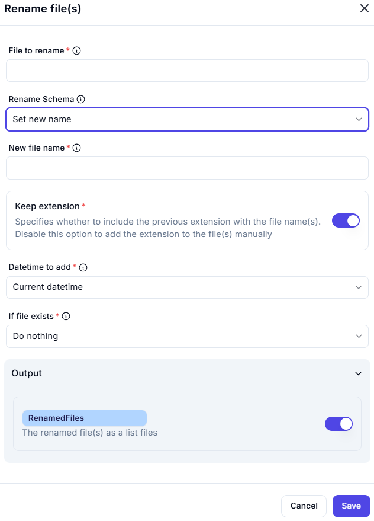

# Rename File(s)

This UI allows users to rename one or more files using customizable naming rules.

---

## Input Fields

### File to Rename *(Required)*
- **Field**: (Empty in screenshot)
- **Description**: Select the file(s) you want to rename.

### Rename Schema
- **Selected Option**: `Set new name`
- **Description**: Defines the renaming strategy.
  - Possible options may include: `Set new name`, `Add prefix`, `Add suffix`, `Replace text`, etc.

### New File Name *(Required)*
- **Field**: (Empty in screenshot)
- **Description**: Enter the new name for the file(s), based on the selected renaming schema.

---

## Options

### Keep Extension *(Required)*
- **Toggle**: Enabled
- **Description**: Specifies whether to retain the original file extension (e.g., `.txt`, `.jpg`).
  - If disabled, the extension must be added manually.

### Datetime to Add *(Required)*
- **Dropdown Selection**: `Current datetime`
- **Description**: Appends the specified datetime format to the file name.
  - Other potential options: `Creation date`, `Modified date`, or `None`.

### If File Exists *(Required)*
- **Dropdown Selection**: `Do nothing`
- **Description**: Defines what action to take if a file with the target name already exists.
  - Possible alternatives: `Overwrite`, `Add counter`, `Skip`, etc.

---

## Output

### Output Variable
- **Name**: `RenamedFiles`
- **Description**: A list containing the newly renamed file(s).
- **Toggle Status**: Enabled

---