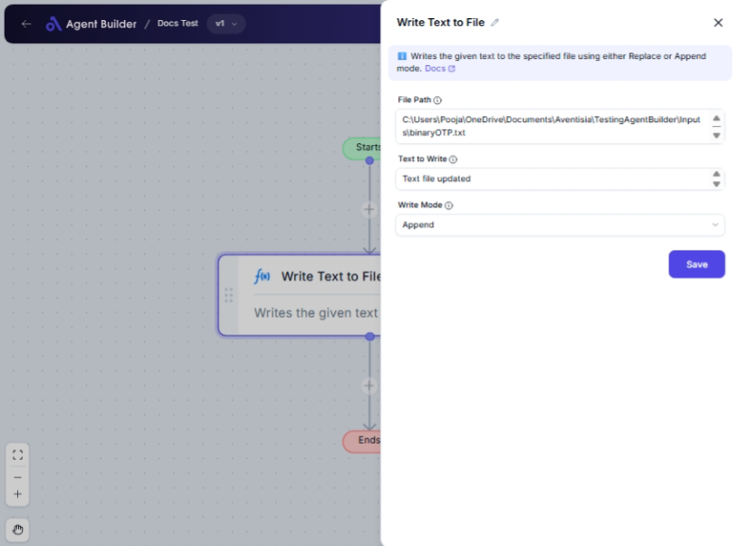

import { Callout, Steps } from "nextra/components";

# Write Text to File

The **Write Text to File** node enables you to automatically save text content to a specified file on your computer. This node is helpful when you want to automate the process of creating, updating, or maintaining text files with specific data content. You can decide whether to add new text to the existing content of a file or replace everything in it.

For example:

- Saving dynamically generated reports or logs to a file.
- Appending user inputs to a log file for future reference.
- Overwriting contents of a configuration file with new settings.

## Configuration Options

| Field Name        | Description                                          | Input Type | Required? | Default Value |
| ----------------- | ---------------------------------------------------- | ---------- | --------- | ------------- |
| **File Path**     | The full file path where the text should be written. | Text       | Yes       | _(empty)_     |
| **Text to Write** | The text content to write to the file.               | Text       | Yes       | _(empty)_     |
| **Write Mode**    | Specifies the write mode: Append or Overwrite.       | Select     | No        | Append        |

## Expected Output Format

This node does not produce a direct output in terms of data. Instead, it performs an action – writing text to a file specified in the **File Path** field. You won’t see an output value like a number or string, but you can verify the action by checking the file contents.

## Step-by-Step Guide

<Steps>
### Step 1

Add **Write Text to File** node into your flow.

### Step 2

In the **File Path** field, enter the path where you want the text to be saved. Ensure this path includes the full filename and extension (e.g., `C:\Users\YourName\Documents\output.txt`).

### Step 3

In the **Text to Write** field, type or paste the text you want to save into the file.

### Step 4

Choose the **Write Mode** from the dropdown:

- **Append**: Adds the new text to the existing file content.
- **Overwrite**: Completely replaces the existing content with the new text.

### Step 5

Confirm your settings and execute the node to write the text to the specified file path.

</Steps>

<Callout type="warning" title="Important">
  Make sure the file path is correct and accessible; otherwise, the text will
  not be written. Double-check permissions and directory existence.
</Callout>

## Input/Output Examples

| File Path                    | Text to Write          | Write Mode | File Content After Operation              |
| ---------------------------- | ---------------------- | ---------- | ----------------------------------------- |
| `C:\Users\Docs\summary.txt`  | `Monthly sales report` | Append     | Previous content + `Monthly sales report` |
| `C:\Users\Logs\activity.log` | `User logged in`       | Overwrite  | Only `User logged in` will remain in file |

## Common Mistakes & Troubleshooting

| Problem                              | Solution                                                                                                                          |
| ------------------------------------ | --------------------------------------------------------------------------------------------------------------------------------- |
| **Invalid file path or permissions** | Ensure the file path is correct and you have write permissions for the directory.                                                 |
| **Text not appearing in file**       | Check the Write Mode setting and ensure the path and filename are typed accurately. Also, verify the node execution is completed. |

## Real-World Use Cases

- **Automated Reporting**: Generate text reports periodically and save them with the current date in their filenames.
- **Log Maintenance**: Continuously append user interactions to a log file for audit trails.
- **Configuration Management**: Update settings files dynamically by overwriting them with new configurations.
