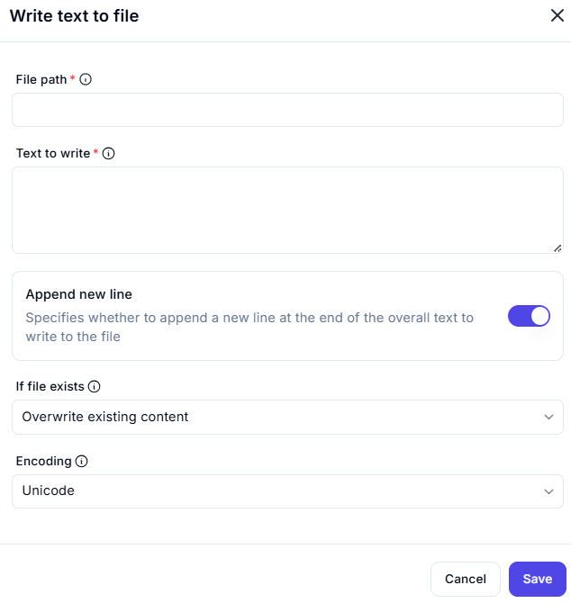

# Write Text to File

This interface allows you to write specified text to a file with various configuration options.

---

## Input Fields

### File path *(Required)*
- **Field**: _(Empty in the screenshot)_
- **Description**: The full path where the file should be created or updated (e.g., `C:\Documents\output.txt`).

### Text to write *(Required)*
- **Field**: _(Empty in the screenshot)_
- **Description**: The text content that will be written to the specified file.

---

## Options

### Append new line
- **Toggle**: Enabled
- **Description**: When enabled, a newline character is added after the text (like pressing "Enter").

### If file exists
- **Dropdown Selection**: `Overwrite existing content`
- **Description**: Defines how to handle existing files.
  - **Options may include**:
    - `Overwrite existing content`
    - `Append to existing content`
    - `Do nothing` or `Fail if exists`

### Encoding
- **Dropdown Selection**: `Unicode`
- **Description**: Sets the character encoding for the file.
  - **Common values**: `Unicode`, `UTF-8`, `ASCII`

---

## Notes

- The file will be created if it does not exist.
- Be cautious when `Overwrite` is selected to prevent accidental data loss.
- The encoding setting ensures compatibility with systems or applications that read the file.
