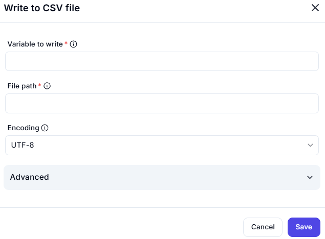

# Write to CSV File Interface

This interface is designed to export data (from a variable) into a CSV (Comma-Separated Values) file format with configurable options.

---

## Input Fields

### Variable to write *(Required)*
- **Field**: _(Empty in the screenshot)_
- **Description**: The variable that contains the data table or list of records to be written to the CSV file.

### File path *(Required)*
- **Field**: _(Empty in the screenshot)_
- **Description**: The path where the CSV file will be saved. Example: `C:\Users\Documents\data.csv`.

### Encoding
- **Dropdown Selection**: `UTF-8`
- **Description**: Specifies the character encoding for the output CSV file.
  - **Common options**:
    - `UTF-8` (default and widely supported)
    - `Unicode`
    - `ASCII`

---

## Notes

- Ensure the variable format matches expected tabular data (e.g., list of dictionaries or data table).
- File will be overwritten if it already exists unless explicitly configured otherwise.
- UTF-8 is a safe default for most systems and ensures international character support.
