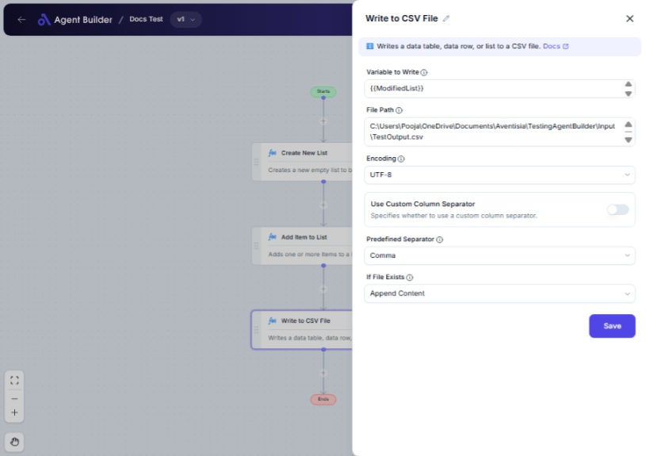

import { Callout, Steps } from "nextra/components";

# Write to CSV File

The **Write to CSV File** node is used to export data from your flow into a CSV file. This is helpful when you need to save data records, tables, or lists in a structured format that is easy to share or import into spreadsheet applications.

For example:

- You can save a list of customer data for further analysis in Excel.
- You can archive transaction records for later reference.
- You can synchronize processed data with other systems by exporting it into CSV format.

{/*  */}

## Configuration Options

| Field Name                      | Description                                                                          | Input Type | Required? | Default Value |
| ------------------------------- | ------------------------------------------------------------------------------------ | ---------- | --------- | ------------- |
| **Variable to Write**           | The data to write to the CSV file (DataTable, DataRow, or List).                     | Text       | Yes       | _(empty)_     |
| **File Path**                   | The full path of the CSV file to write.                                              | Text       | Yes       | _(empty)_     |
| **Encoding**                    | The encoding of the CSV file.                                                        | Select     | No        | UTF-8         |
| **Use Custom Column Separator** | Choose whether to use a custom column separator for this file.                       | Switch     | No        | False         |
| **Custom Column Separator**     | The custom delimiter used in the CSV file. _Only appears if using custom separator._ | Text       | No        | _(empty)_     |
| **Predefined Separator**        | The predefined separator used in the CSV file (Comma, Tab, Semicolon).               | Select     | No        | Comma         |
| **If File Exists**              | How to handle the file if it already exists (Overwrite or Append content).           | Select     | No        | Overwrite     |

## Expected Output Format

The node does not directly produce a data output. Instead, it writes the processed data into a specified CSV file, which will be accessible at the location specified in the **File Path**.

## Step-by-Step Guide

<Steps>
### Step 1

Add **Write to CSV File** node into your flow.

### Step 2

In the **Variable to Write** field, specify the data (such as DataTable, DataRow, or List) you want to write to the CSV file.

### Step 3

Enter the desired path for your CSV file in the **File Path** field. Ensure it's a valid path where you have write permissions.

### Step 4

Choose the **Encoding** you'd like for your file. Generally, UTF-8 suffices for most applications.

### Step 5

Determine if you want to use a **Custom Column Separator**:

- If yes, toggle the switch and specify your delimiter in **Custom Column Separator** field.
- If not, select a **Predefined Separator** such as Comma, Tab, or Semicolon.

### Step 6

Specify what should happen if the CSV file already exists using **If File Exists**:

- **Overwrite**: Replaces existing content.
- **Append**: Adds new data to the end of the file.

### Step 7

Complete the setup, and your flow will automatically write data to the CSV file as configured.

</Steps>

<Callout type="info" title="Tip">
  Choose "Append" in **If File Exists** to add data incrementally without losing
  previous contents.
</Callout>

## Input/Output Examples

| Variable to Write | File Path                | Encoding | Custom Column Separator | Predefined Separator | If File Exists | Action                                               |
| ----------------- | ------------------------ | -------- | ----------------------- | -------------------- | -------------- | ---------------------------------------------------- |
| CustomersList     | C:/data/customers.csv    | UTF-8    | _(n/a)_                 | Comma                | Overwrite      | Creates a new CSV file or replaces existing content. |
| Transactions      | C:/data/transactions.csv | ASCII    | ;                       | _(n/a)_              | Append         | Appends records to an existing CSV file.             |

## Common Mistakes & Troubleshooting

| Problem                         | Solution                                                                                                                        |
| ------------------------------- | ------------------------------------------------------------------------------------------------------------------------------- |
| **File Path is invalid**        | Double-check the file path and ensure you have the necessary permissions to write files to that location.                       |
| **Data is not written to file** | Ensure that the data variable specified in **Variable to Write** is correctly populated and accessible within the flow.         |
| **Unexpected file encoding**    | Verify and match encoding settings with the application you intend to use the file with to avoid incompatible character issues. |

## Real-World Use Cases

- **Sales Reports**: Regularly export sales data for detailed analysis in CSV format.
- **User Data Backup**: Write user activity logs to CSV files for long-term storage.
- **Invoice Processing**: Automatically save processed invoices as CSV files, facilitating easy sharing and integration with CRM systems.
