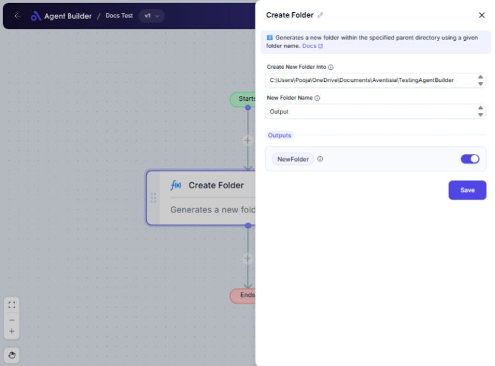

import { Callout, Steps } from "nextra/components";

# Create Folder

The **Create Folder** node is a straightforward tool that allows you to create a new folder in a specified location on your computer. This node is particularly useful when organizing files into distinct directories as part of a larger, automated workflow. By designating a parent directory and a desired folder name, you can efficiently manage your file storage structure without manually opening file explorers.

{/*  */}

## Configuration Options

| Field Name                 | Description                                                                   | Input Type | Required? | Default Value |
| -------------------------- | ----------------------------------------------------------------------------- | ---------- | --------- | ------------- |
| **Create New Folder Into** | The full path of the parent directory where the new folder should be created. | Text       | Yes       | _(empty)_     |
| **New Folder Name**        | The name of the folder to be created inside the specified parent directory.   | Text       | Yes       | _(empty)_     |

## Expected Output Format

- The output of this node is a **full path string** to the newly created folder.

- For example, if a folder named "Reports" is created inside "C:\Users\Documents", the output will be `"C:\Users\Documents\Reports"`.

## Step-by-Step Guide

<Steps>
### Step 1

Add the **Create Folder** node into your flow.

### Step 2

In the **Create New Folder Into** field, type the full path of the parent directory where you want the new folder to be created.

### Step 3

In the **New Folder Name** field, enter the name of the folder you wish to create.

### Step 4

After configuration, the full path of the newly created folder will be available as **NewFolder** for use in subsequent nodes.

</Steps>

<Callout type="info" title="Tip">
  Ensure that the parent directory already exists. This node will create the new
  folder in the specified directory but will not create the parent directory if
  it does not exist.
</Callout>

## Input/Output Examples

| Input - Parent Directory | Input - Folder Name | Output - New Folder Path         |
| ------------------------ | ------------------- | -------------------------------- |
| `C:\Users\Documents`     | Reports             | `C:\Users\Documents\Reports`     |
| `/home/user/projects`    | NewProject          | `/home/user/projects/NewProject` |

## Common Mistakes & Troubleshooting

| Problem                               | Solution                                                                                    |
| ------------------------------------- | ------------------------------------------------------------------------------------------- |
| **Directory Path Not Found**          | Double-check the path in **Create New Folder Into**; ensure the path exists and is correct. |
| **Invalid Characters in Folder Name** | Ensure the folder name does not contain any characters that are not allowed by your OS.     |
| **Permission Denied**                 | Verify you have the necessary permissions to create folders in the specified directory.     |

## Real-World Use Cases

- **Organizing File Transfers**: Automatically create a new directory for organizing daily file uploads or downloads.
- **Project Management**: Efficiently set up directories for each new project, maintaining organization across different teams.
- **Archiving Documents**: Create folders by date or category for systematic archiving of documents, enhancing retrieval speed.
