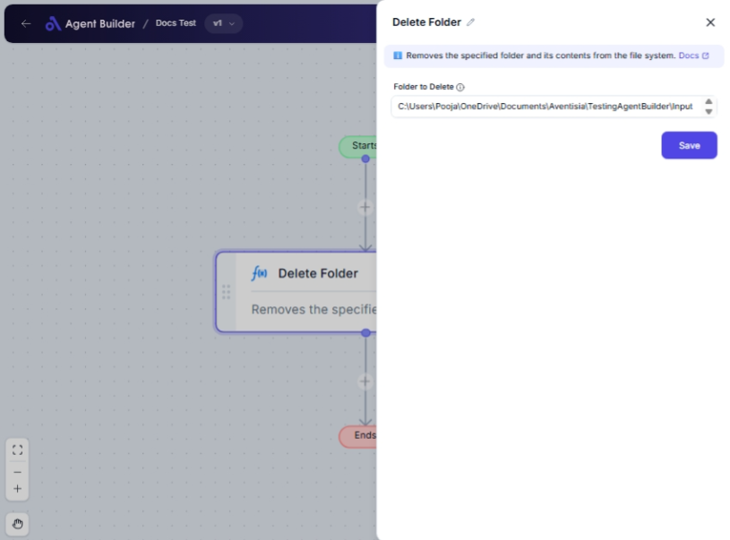

import { Callout, Steps } from "nextra/components";

# Delete Folder

The **Delete Folder** node allows you to remove a specified folder from your file system. This is particularly useful in workflow automation when you need to ensure that old, unnecessary, or temporary folders are cleaned up during batch processes or scheduled tasks.

For example:

- Clearing out a temporary directory after processing.
- Automatically removing outdated folders based on certain criteria.
- Organizing your workspace by deleting unneeded folders.

## Configuration Options

| Field Name           | Description                                      | Input Type | Required? | Default Value |
| -------------------- | ------------------------------------------------ | ---------- | --------- | ------------- |
| **Folder to Delete** | Full path of the folder that you want to delete. | Text       | Yes       | _(empty)_     |

## Expected Output Format

The output of this node is a **confirmation message** indicating whether the folder was successfully deleted or an error message if the operation failed.

## Step-by-Step Guide

<Steps>
### Step 1

Add **Delete Folder** node into your flow.

### Step 2

In the **Folder to Delete** field, enter the full path of the folder you want to remove.

### Step 3

Trigger the node to start the deletion process.

### Step 4

Check the output for a confirmation message to ensure the folder has been deleted.

</Steps>

<Callout type="warning" title="Important">
  Make sure to double-check the folder path entered in the **Folder to Delete**
  field. Deleting a folder is irreversible and can lead to loss of important
  data.
</Callout>

## Input/Output Examples

| Folder Path        | Output Message               | Output Type   |
| ------------------ | ---------------------------- | ------------- |
| `C:\Temp\OldFiles` | Folder deleted successfully. | Confirmation  |
| `C:\NonExistent`   | Error: Folder not found.     | Error Message |

## Common Mistakes & Troubleshooting

| Problem                                 | Solution                                                                  |
| --------------------------------------- | ------------------------------------------------------------------------- |
| **Incorrect folder path entered**       | Verify the folder path to ensure it’s correct and exists on your system.  |
| **Permission denied error**             | Ensure you have the necessary permissions to delete the specified folder. |
| **Folder is in use by another program** | Close any programs that might be using the folder, then try again.        |

## Real-World Use Cases

- **Log Management**: Automatically delete old log folders as part of file management systems.
- **Temporary File Cleanup**: Periodically clean up temporary folders to save disk space.
- **Project Deadline Management**: Remove project folders after completion or upon exceeding deadline.
