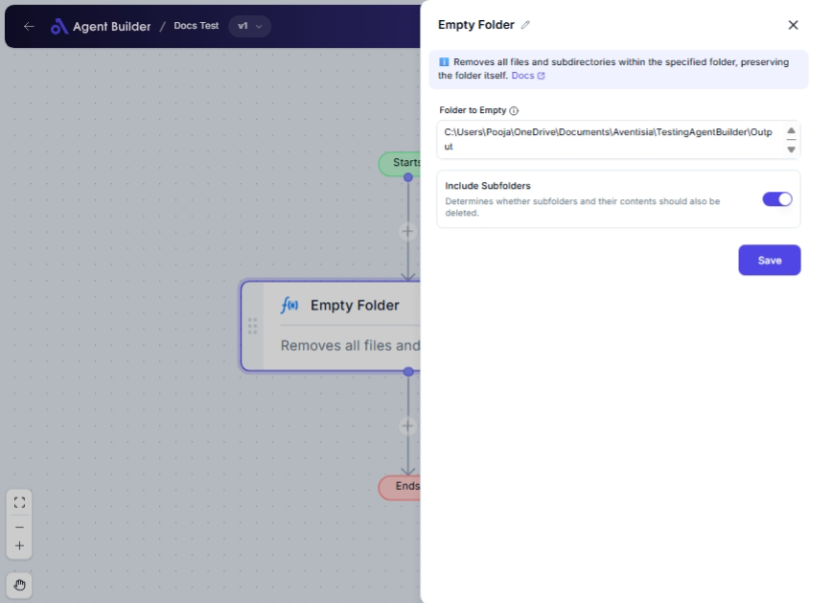

import { Callout, Steps } from "nextra/components";

# Empty Folder

The **Empty Folder** node enables you to automatically delete all contents within a specified folder on your computer. This includes files and, optionally, any subfolders and their contents. Such functionality is useful for regularly cleaning up directories to save space or to ensure certain folders are ready for new files without manually clearing them each time.

## Configuration Options

| Field Name             | Description                                                              | Input Type | Required? | Default Value |
| ---------------------- | ------------------------------------------------------------------------ | ---------- | --------- | ------------- |
| **Folder to Empty**    | Specify the path of the folder whose contents should be deleted.         | Text       | Yes       | _(empty)_     |
| **Include Subfolders** | Determines whether subfolders and their contents should also be deleted. | Switch     | No        | Yes           |

## Expected Output Format

There is no direct output from this node in terms of data value. However, the output action is that the specified folder gets emptied.

## Step-by-Step Guide

<Steps>
### Step 1

Add **Empty Folder** node into your flow.

### Step 2

In the **Folder to Empty** field, enter the full path of the folder you want to clear.

### Step 3

Toggle the **Include Subfolders** switch depending on your preference:

- **Yes**: Will delete subfolders and all their contents.
- **No**: Only the files in the main folder are deleted, leaving subfolders intact.

### Step 4

Proceed to integrate the node in your workflow, ensuring that the folders you want to keep are unaffected.

</Steps>

<Callout type="warning" title="Caution">
  Use this node cautiously, especially with the **Include Subfolders** option
  enabled, to avoid accidentally losing important data.
</Callout>

## Input/Output Examples

| Folder Path        | Include Subfolders | Result                                                                         |
| ------------------ | ------------------ | ------------------------------------------------------------------------------ |
| `C:/Projects/Temp` | Yes                | All contents, including subfolders in `C:/Projects/Temp`, are deleted.         |
| `C:/Projects/Data` | No                 | Only the files in `C:/Projects/Data` are deleted; subfolders remain untouched. |

## Common Mistakes & Troubleshooting

| Problem                             | Solution                                                                                                        |
| ----------------------------------- | --------------------------------------------------------------------------------------------------------------- |
| **Path Not Recognized**             | Ensure the folder path is correct and accessible. Double-check for typos or permission issues.                  |
| **Unintended Data Loss**            | Verify if the **Include Subfolders** setting matches your intent to prevent unintended deletions.               |
| **Node Not Performing as Expected** | Confirm the node is correctly configured and check the folder path for accessibility before executing the flow. |

## Real-World Use Cases

- **Daily Log Cleanup**: Use the node to empty a folder of daily logs once they are processed, ensuring disk space is managed.
- **Temporary Data Purge**: Regularly clear project folders of temporary processing files without entering each directory manually.
- **Email Attachments**: Automatically clear out an email attachments folder to ensure it is ready for new incoming files.
