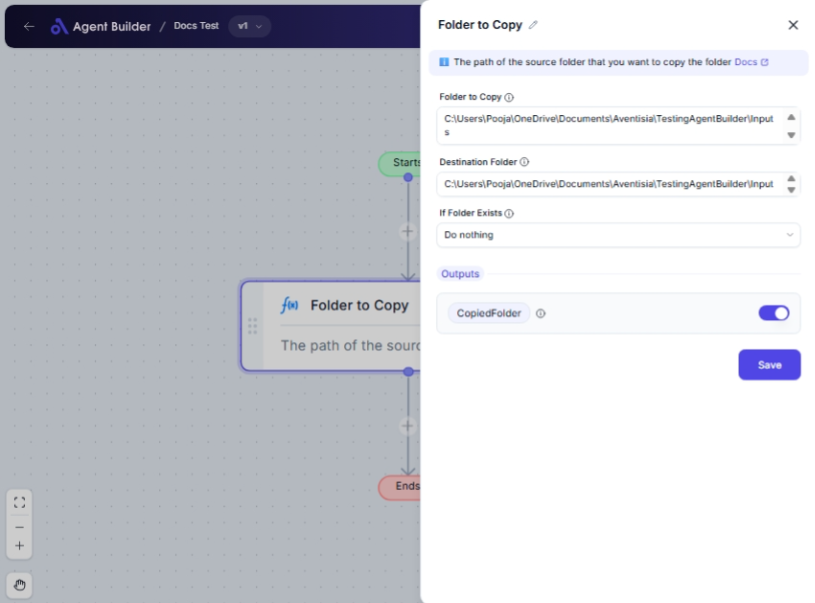

import { Callout, Steps } from "nextra/components";

# Folder to Copy

The **Folder to Copy** node enables you to duplicate a folder from one location to another on your computer. This is useful for creating backups, making copies for distribution, or reorganizing files across different directories. It allows you to define what to do if the destination folder already contains duplicate files, making the operation flexible according to your needs.

{/*  */}

## Configuration Options

| Field Name             | Description                                                            | Input Type | Required? | Default Value |
| ---------------------- | ---------------------------------------------------------------------- | ---------- | --------- | ------------- |
| **Folder to Copy**     | The path of the source folder that you want to duplicate.              | Text       | Yes       | _(empty)_     |
| **Destination Folder** | The path where the folder should be copied.                            | Text       | Yes       | _(empty)_     |
| **If Folder Exists**   | Specifies the action to take if the destination folder already exists. | Select     | Yes       | DoNothing     |

## Expected Output Format

The node provides a **confirmation of the copied folder path** in text format.

- **Output**: The path to the duplicated folder, confirming successful operation (e.g., `C:/backup/copied-folder`).

## Step-by-Step Guide

<Steps>
### Step 1

Add the **Folder to Copy** node into your workflow.

### Step 2

In the **Folder to Copy** field, enter the path of the folder you wish to duplicate.

### Step 3

Enter the **Destination Folder** path where you want your folder to be duplicated.

### Step 4

Select an option from the **If Folder Exists** dropdown to specify what to do if the folder already exists at the destination:

- **Do nothing**: Skip the operation if the folder exists.
- **Overwrite**: Replace the existing folder with the new one.

### Step 5

After setup, execute your workflow to copy the folder. The path of the copied folder will be available as **CopiedFolder** for further use.

</Steps>

<Callout type="info" title="Tip">
  Ensure both the source and destination paths are correct to avoid errors
  during duplication. Mistakes in paths can lead to failures in copying.
</Callout>

## Input/Output Examples

| Source Path          | Destination Path   | If Folder Exists | Resulting Copied Path | Output             |
| -------------------- | ------------------ | ---------------- | --------------------- | ------------------ |
| `C:/projects/source` | `D:/backup/source` | Do nothing       | _(No copy made)_      | _(empty)_          |
| `C:/projects/source` | `D:/backup/source` | Overwrite        | `D:/backup/source`    | Copied Folder Path |

## Common Mistakes & Troubleshooting

| Problem                                            | Solution                                                                                                                                               |
| -------------------------------------------------- | ------------------------------------------------------------------------------------------------------------------------------------------------------ |
| **Paths are incorrect or inaccessible**            | Double-check the paths entered in both **Folder to Copy** and **Destination Folder** fields. Ensure you have the necessary permissions for both paths. |
| **Folder not copied when existing at destination** | Ensure you selected **Overwrite** if your intention was to replace an existing folder at the destination.                                              |

## Real-World Use Cases

- **Project Backups**: Quickly duplicate project folders for version backups or multi-location work.
- **File Distribution**: Copy folders to different locations for distribution or sharing without modifying the original.
- **File Organization**: Rearrange data across various directories by copying folders based on your organizational needs.
