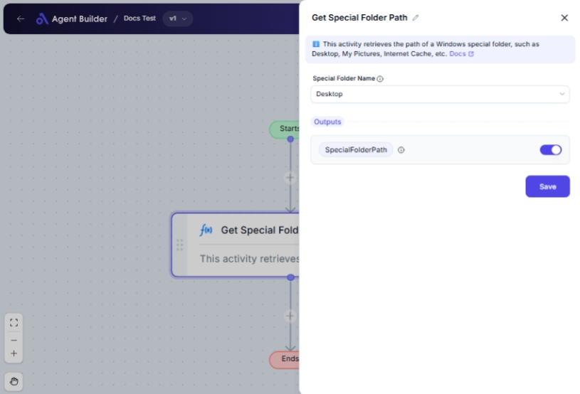

import { Callout, Steps } from "nextra/components";

# Get Special Folder Path

The **Get Special Folder Path** node allows you to retrieve the file path of commonly used folders in your operating system without navigating through directories manually. This node simplifies accessing important folders like "Desktop", "Music", or application data storage for further operations.

Use this node when you need a fast and reliable way to obtain the full path of system directories for automation tasks, file management, or configuration settings.

 

## Configuration Options

| Field Name              | Description                                                            | Input Type | Required? | Default Value |
| ----------------------- | ---------------------------------------------------------------------- | ---------- | --------- | ------------- |
| **Special Folder Name** | Select the name of the special folder whose path you want to retrieve. | Select     | No        | Desktop       |

## Expected Output Format

The output of this node is a **string value** representing the full path of the selected special folder.

- Example: `"C:\\Users\\YourName\\Desktop"`

## Step-by-Step Guide

<Steps>
### Step 1

Add **Get Special Folder Path** node into your flow.

### Step 2

In the **Special Folder Name** dropdown, select the folder whose path you need:

- **Desktop**: To get the path of your Desktop folder.
- **Music**: To access your Music folder directory.
- **Templates**: For templates storage path.
- **ApplicationData**: For application data files.
- **LocalApplicationData**: For local app data files.
- **InternetCache**: To locate browser cache files.
- **Cookies**: To find the cookies folder.
- **History**: To access the browsing history folder.

### Step 3

Once configured, the node retrieves the path as **SpecialFolderPath**, which can be used in subsequent flow steps.

</Steps>

<Callout type="info" title="Tip">
  Not all special folders may be accessible depending on your system settings
  and permissions. Make sure you have appropriate access rights.
</Callout>

## Input/Output Examples

| Special Folder Name | Output Path Example                           | Output Type |
| ------------------- | --------------------------------------------- | ----------- |
| Desktop             | C:\\Users\\YourName\\Desktop                  | String      |
| Music               | C:\\Users\\YourName\\Music                    | String      |
| ApplicationData     | C:\\Users\\YourName\\AppData\\ApplicationData | String      |
| History             | C:\\Users\\YourName\\AppData\\Local\\History  | String      |

## Common Mistakes & Troubleshooting

| Problem                     | Solution                                                                                              |
| --------------------------- | ----------------------------------------------------------------------------------------------------- |
| **No path returned**        | Confirm the folder exists and that you have selected the correct special folder name.                 |
| **Permission denied error** | Ensure you have the necessary permissions to access the folder or consult with your IT administrator. |

## Real-World Use Cases

- **Automating File Backups**: Quickly access and backup Desktop or Music files regularly.
- **Data Migration**: Retrieve app data folder paths for efficient data migration or system setups.
- **Software Configuration**: Use folder paths to set configuration files in application setup scripts.
