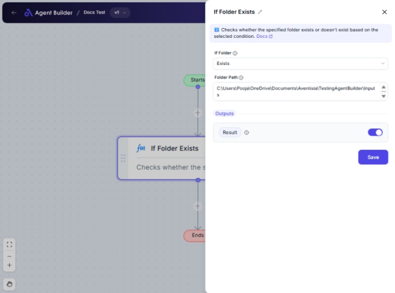

import { Callout, Steps } from "nextra/components";

# If Folder Exists

The **If Folder Exists** node allows you to check whether a specific folder exists or does not exist on your desktop or system. This node is helpful if you need to verify folder presence as a trigger or condition in your automation tasks.

For example:

- Confirm that a folder exists before saving files into it.
- Ensure a folder does not exist to prevent overwriting data.

## Configuration Options

| Field Name      | Description                                                             | Input Type | Required? | Default Value |
| --------------- | ----------------------------------------------------------------------- | ---------- | --------- | ------------- |
| **If Folder**   | Select the condition to check for the folder: whether it exists or not. | Select     | Yes       | Exists        |
| **Folder Path** | The path of the folder to check for existence.                          | Text       | Yes       | _(empty)_     |

## Expected Output Format

The output of this node is a **Boolean value** (`true` or `false`).

- `true`: The condition (Exists/Does Not Exist) is met.
- `false`: The condition is not met.

## Step-by-Step Guide

<Steps>
### Step 1

Add **If Folder Exists** node to your flow.

### Step 2

In the **If Folder** dropdown, select the condition you want to check:

- **Exists**: Verify that the folder is present.
- **Doesn't Exist**: Verify that the folder is absent.

### Step 3

In the **Folder Path** field, enter the complete path of the folder you wish to check.

### Step 4

The result, indicating if the folder meets the condition, will be available as **Result** for use in other nodes.

</Steps>

<Callout type="info" title="Tip">
  Ensure the folder path is accurate to avoid false results. Double-check before
  entering it.
</Callout>

## Input/Output Examples

| Condition     | Folder Path       | Output Value | Output Type |
| ------------- | ----------------- | ------------ | ----------- |
| Exists        | `/user/documents` | true         | Boolean     |
| Doesn't Exist | `/user/archive`   | false        | Boolean     |

## Common Mistakes & Troubleshooting

| Problem                   | Solution                                                                                                              |
| ------------------------- | --------------------------------------------------------------------------------------------------------------------- |
| **Incorrect Folder Path** | Verify that the folder path is entered correctly, including all necessary subfolders and with correct capitalization. |
| **Unexpected Output**     | Ensure you selected the correct condition in the If Folder dropdown.                                                  |

## Real-World Use Cases

- **Data Archiving**: Check if a backup folder already exists before archiving data to avoid duplications.
- **Workflow Pre-checks**: Ensure required folders are created before executing file operations in a workflow.
- **Safety Checks**: Verify that a specific folder does not exist before creating it to prevent data overwriting.
