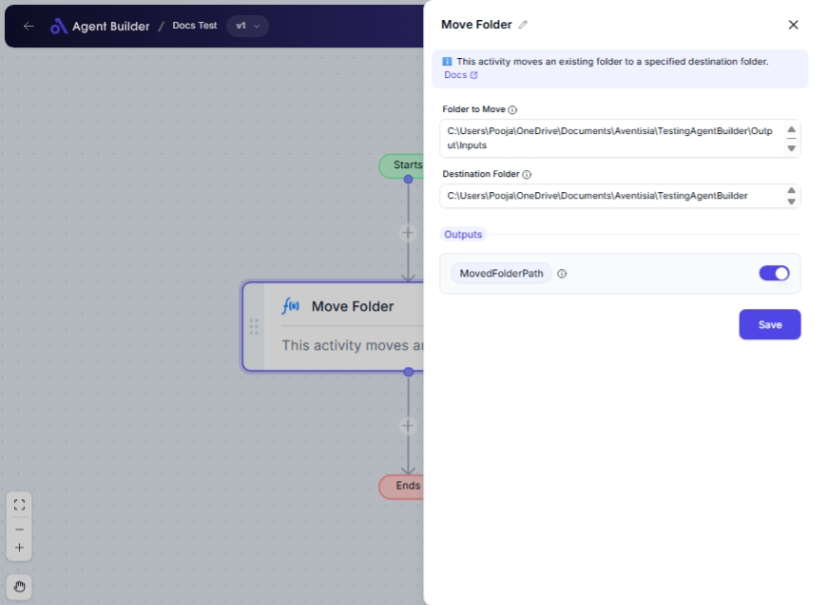

import { Callout, Steps } from "nextra/components";

# Move Folder

The **Move Folder** node allows you to transfer a folder from one location to another on your computer. This feature is useful when reorganizing files, backing up data, or preparing folders for processing or sharing.

For example:

- Moving a project folder to an archive directory.
- Transferring a folder to a shared network location for team access.
- Reorganizing folders for improved file management.

{/*  */}

## Configuration Options

| Field Name             | Description                                                                         | Input Type | Required? | Default Value |
| ---------------------- | ----------------------------------------------------------------------------------- | ---------- | --------- | ------------- |
| **Folder to Move**     | Specifies the path of the folder that needs to be moved.                            | Text       | No        | _(empty)_     |
| **Destination Folder** | Specifies the path of the destination folder where the source folder will be moved. | Text       | No        | _(empty)_     |

## Expected Output Format

The output of this node is the **path of the moved folder** as a string.

## Step-by-Step Guide

<Steps>
### Step 1

Add the **Move Folder** node into your flow.

### Step 2

In the **Folder to Move** field, enter the path of the folder you want to move.

### Step 3

In the **Destination Folder** field, enter the path where you want the folder to be moved.

### Step 4

Once configured, the node will move the specified folder and the path of the moved folder will be available as **MovedFolderPath** for use in other nodes.

</Steps>

<Callout type="info" title="Note">
  The source and destination paths must be accessible and valid. Ensure that the
  destination path exists and has the necessary write permissions.
</Callout>

## Input/Output Examples

| Folder to Move               | Destination Folder | Output Value               | Output Type   |
| ---------------------------- | ------------------ | -------------------------- | ------------- |
| `C:\Users\Documents\Reports` | `E:\Archives\2023` | `E:\Archives\2023\Reports` | String (Path) |

## Common Mistakes & Troubleshooting

| Problem                            | Solution                                                                                                            |
| ---------------------------------- | ------------------------------------------------------------------------------------------------------------------- |
| **Invalid path entered**           | Double-check the folder paths you entered. Paths must be valid and correctly formatted.                             |
| **Insufficient permissions error** | Ensure you have the required permissions to read from the source and write to the destination folder.               |
| **Folder not moving**              | Verify that the destination path is accessible and that no other process is using the folder you're trying to move. |

## Real-World Use Cases

- **Data Organization**: Moving completed project folders to an archive location to free up space in the working directory.
- **Team Collaboration**: Transferring common resource folders to a shared network drive for team access and usage.
- **Backup Process**: Automating the movement of critical data folders to a backup location regularly.
