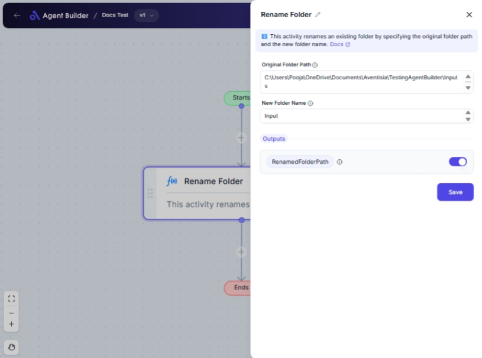

import { Callout, Steps } from "nextra/components";

# Rename Folder

The **Rename Folder** node allows you to change the name of an existing folder on your system. This can be particularly useful for organizing files, updating folder names to reflect new project stages, or simply correcting naming errors. Use this node when you need to systematically rename folders within an automated workflow.

## Configuration Options

| Field Name               | Description                                     | Input Type | Required? | Default Value |
| ------------------------ | ----------------------------------------------- | ---------- | --------- | ------------- |
| **Original Folder Path** | The path of the folder that you want to rename. | Text       | No        | _(empty)_     |
| **New Folder Name**      | The new name you wish to assign to the folder.  | Text       | No        | _(empty)_     |

## Expected Output Format

The output of this node is the **Renamed Folder Path**, which is a text string representing the full path of the folder after it has been renamed. For example, if you renamed "C:\OldFolder" to "NewFolder", the output will be "C:\NewFolder".

## Step-by-Step Guide

<Steps>
### Step 1

Add a **Rename Folder** node to your flow.

### Step 2

In the **Original Folder Path** field, enter the path of the folder you want to rename (e.g., `C:\Documents\OldFolder`).

### Step 3

In the **New Folder Name** field, specify the new name for the folder (e.g., `NewFolder`).

### Step 4

The updated folder path will be available as **RenamedFolderPath** for use in other nodes.

</Steps>

<Callout type="info" title="Tip">
  Ensure that the folder path you provide in **Original Folder Path** is correct
  and accessible to avoid any issues during the renaming process.
</Callout>

## Common Mistakes & Troubleshooting

| Problem                                 | Solution                                                                                                     |
| --------------------------------------- | ------------------------------------------------------------------------------------------------------------ |
| **Incorrect folder path specified**     | Double-check the **Original Folder Path** for typos or errors and ensure the folder exists at that location. |
| **Folder already exists with new name** | Rename the existing folder before proceeding or choose a different name in the **New Folder Name** field.    |
| **Permission denied error**             | Ensure you have the necessary permissions to rename the folder at the specified path.                        |

## Real-World Use Cases

- **Project Management**: Rename project folders as they move through different phases (e.g., from "Draft" to "Final").
- **Organizational Tasks**: Systematically update folder names across departments.
- **File Server Maintenance**: Batch rename shared folders for better accessibility or protocol compliance.
