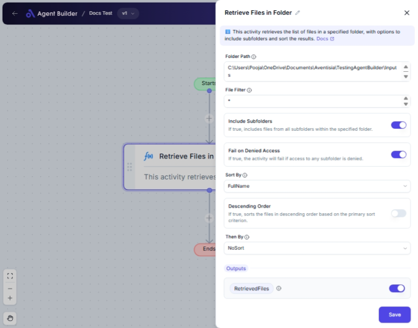

import { Callout, Steps } from "nextra/components";

# Retrieve Files in Folder

The **Retrieve Files in Folder** node helps you gather files from a specified folder on your computer. This can include filtering by file type, sorting, and even retrieving files from subfolders. Use this node when you need to process or analyze files stored in folders, such as preparing a list of documents for batch processing or organizing files by size or date.

## Configuration Options

| Field Name                | Description                                                                                       | Input Type | Required? | Default Value |
| ------------------------- | ------------------------------------------------------------------------------------------------- | ---------- | --------- | ------------- |
| **Folder Path**           | Specifies the path to the folder where files will be retrieved. You can enter this path manually. | Text       | No        | _(empty)_     |
| **File Filter**           | A pattern to filter the files (e.g., `"*.txt"` for text files). Default retrieves all files.      | Text       | No        | `*`           |
| **Include Subfolders**    | If true, includes files from all subfolders within the specified folder.                          | Switch     | No        | `true`        |
| **Fail on Denied Access** | If true, the node will fail if access to any subfolder is denied.                                 | Switch     | No        | `true`        |
| **Sort By**               | The primary criterion to sort the retrieved files.                                                | Select     | No        | NoSort        |
| **Descending Order**      | If true, sorts the files in descending order based on the primary sort criterion.                 | Switch     | No        | `false`       |
| **Then By**               | The secondary criterion to further sort the retrieved files.                                      | Select     | No        | NoSort        |

## Expected Output Format

The output is a **list of file paths** that meet the specified criteria. This list is accessible under the key `RetrievedFiles` and is intended for further use in the workflow.

## Step-by-Step Guide

<Steps>
### Step 1

Add the **Retrieve Files in Folder** node to your workflow.

### Step 2

In the **Folder Path** field, enter the path of the folder from which you want to retrieve files. Leave empty to work with the default location.

### Step 3

In the **File Filter** field, specify the type of files you wish to retrieve by entering a pattern (e.g., `*.pdf` for PDF files).

### Step 4

Toggle the **Include Subfolders** switch to decide whether files in subfolders should also be retrieved.

### Step 5

Toggle the **Fail on Denied Access** switch if you want the node to stop processing upon encountering folders with access issues.

### Step 6

Choose a primary sort criterion from the **Sort By** dropdown if you want to organize your files (e.g., by `Name` or `Size`).

### Step 7

If sorting, decide if you want to sort in descending order by toggling the **Descending Order** switch.

### Step 8

Optionally, select a secondary sorting criterion in the **Then By** dropdown for further organization.

### Step 9

Retrieve the list of file paths from the `RetrievedFiles` output for use elsewhere in your workflow.

</Steps>

<Callout type="info" title="Tip">
  If you're unsure which subfolder to include, start with the base folder only
  and test your configuration by reviewing the output.
</Callout>

## Input/Output Examples

| Folder Path | File Filter | Include Subfolders | Sort By | Then By | Retrieved Files                        | Output Type     |
| ----------- | ----------- | ------------------ | ------- | ------- | -------------------------------------- | --------------- |
| `/docs`     | `*.pdf`     | true               | Name    | Size    | [`/docs/file1.pdf`, `/docs/file2.pdf`] | List of Strings |

## Common Mistakes & Troubleshooting

| Problem                          | Solution                                                                                                   |
| -------------------------------- | ---------------------------------------------------------------------------------------------------------- |
| **Access Denied Error**          | Check folder permissions or switch off **Fail on Denied Access**.                                          |
| **Files Not Retrieved**          | Ensure the **Folder Path** is correct and that the **File Filter** matches the desired file types.         |
| **Expected Sorting Not Applied** | Verify **Sort By** and **Then By** selections, and toggle **Descending Order** if sorting seems incorrect. |

## Real-World Use Cases

- **Monthly Report Compilation**: Automatically retrieve and organize the latest PDF reports from a shared folder for monthly review.
- **Data Processing Pipeline**: Gather all `.csv` files from a data directory to run batch data transformations.
- **Audit Rankings**: Retrieve log files sorted by creation time to prepare reports on system audit sequences.
