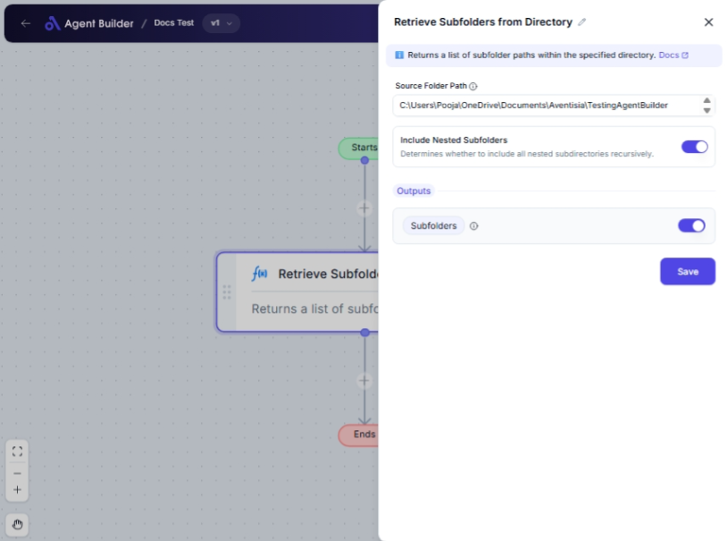

import { Callout, Steps } from "nextra/components";

# Retrieve Subfolders from Directory

The **Retrieve Subfolders from Directory** node helps you find and list all subfolders within a specified directory. It's especially useful for managing files and directories efficiently, such as when you need to organize large data sets or check for subfolder existence before operations.

{/*  */}

## Configuration Options

| Field Name                    | Description                                                             | Input Type | Required? | Default Value |
| ----------------------------- | ----------------------------------------------------------------------- | ---------- | --------- | ------------- |
| **Source Folder Path**        | The full path of the directory from which subfolders will be retrieved. | Text       | Yes       | _(empty)_     |
| **Include Nested Subfolders** | Determines whether to include all nested subdirectories recursively.    | Switch     | No        | False         |

## Expected Output Format

The output of this node is a **list of subfolder paths**:

- Each path in the list is a string that represents the location of a subfolder.
- If nesting is included, the list contains paths for all levels of subdirectories.

## Step-by-Step Guide

<Steps>

### Step 1

Add the **Retrieve Subfolders from Directory** node into your flow.

### Step 2

In the **Source Folder Path** field, enter the absolute path of the directory you want to scan for subfolders.

### Step 3

If you wish to include subfolders within other subfolders, enable the **Include Nested Subfolders** switch.

### Step 4

Once configured, the node will output a list of all subfolder paths found at the specified location. The output will be available as **Subfolder List** for use in other nodes.

</Steps>

<Callout type="tip" title="Tip">
  Ensure that the path entered in the **Source Folder Path** field is correct
  and accessible by the system running the automation.
</Callout>

## Input/Output Examples

| Source Folder Path   | Include Nested Subfolders | Output Value                                                                                                    | Output Type   |
| -------------------- | ------------------------- | --------------------------------------------------------------------------------------------------------------- | ------------- |
| `C:\Users\Documents` | No                        | `["C:\\Users\\Documents\\Reports", "C:\\Users\\Documents\\Projects"]`                                           | List of Paths |
| `C:\Users\Documents` | Yes                       | `["C:\\Users\\Documents\\Reports", "C:\\Users\\Documents\\Projects", "C:\\Users\\Documents\\Projects\\Drafts"]` | List of Paths |

## Common Mistakes & Troubleshooting

| Problem                                                      | Solution                                                                                      |
| ------------------------------------------------------------ | --------------------------------------------------------------------------------------------- |
| **Invalid directory path entered**                           | Double-check the path for typos or errors. Ensure the directory exists and is accessible.     |
| **Empty subfolder list when expected subfolders**            | Confirm the directory actually contains subfolders. Also, ensure the path is correct.         |
| **Include Nested Subfolders switch not working as expected** | Verify if nested subfolders exist in the specified directory, and that the switch is enabled. |

## Real-World Use Cases

- **Project Management**: Organize and retrieve all subdirectories within a project folder for efficient data handling.
- **Batch Processing**: Gather subfolder paths to apply automated processes to files within each subfolder.
- **System Backup**: List subdirectories for backup routines, ensuring all data under specific directories is captured.
